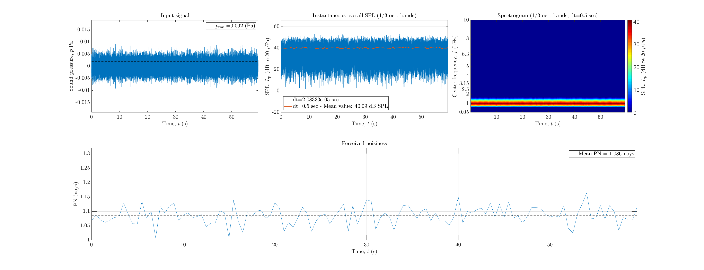

# About this code 
The `run_validation_PN.m` code is used to verify if the Perceived Noisiness, PN in Noys, is being correctly calculated in the Effective Perceived Noise Level (EPNL) code (see `EPNL_FAR_Part36` code [here](../../psychoacoustic_metrics/EPNL_FAR_Part36/EPNL_FAR_Part36.m)). The verification is performed considering the following test signal:

- Band-passed white-noise, with a bandwidth of $\mathrm{BW} = 891.3 - 1122 = 220.7 Hz, which corresponds to the third octave band around the center frequency $f_{\mathrm{c}}=1$~kHz, and a rms level of 40 dB SPL.

PLEASE NOTE: computing the EPNL from this signal dont make any sense as this is not an aircraft fly over nor (more generally) a signal with time-varying amplitude. It is used here only for the purpose of verifying the PN implementation. 

# How to use this code
The test signal is generated in the code. Therefore, no extra steps are required to run this code.

# Results
According to Refs. [1,2], the numerical value of 1 Noy, was assigned to the Perceived Noisiness of an third octave of random noise centered at 1 kHz, and with a rms level of 40 dB SPL. The figure below shows the results obtained using the test signal and the `EPNL_FAR_Part36` implementation in SQAT. It is possible to observe that the test signal is correctly generated in terms of SPL and spectral content. Moreover, the time-averaged Perceived Noisiness value computed is 1.086 Noys.
  
  :-------------------------:| 
      

# References
[1] Smith, M. (1989). Human reaction to aircraft noise. In Aircraft Noise (Cambridge Aerospace Series, pp. 1-19). Cambridge University Press. doi:[10.1017/CBO9780511584527.002]{https://www.cambridge.org/core/books/aircraft-noise/7C4059C54DF8EC87C2F34262BC865E36} (relevant info can be found in page 7)

[2] Bennett, R.L. & Persons, K.S. (1981) Handbook of aircraft noise metrics. NASA - Contractor Report no. NASA CR-3406. [https://ntrs.nasa.gov/citations/19810013341]{https://ntrs.nasa.gov/citations/19810013341} (Last viewed 30 Oct. 2023) (relevant info can be found in page 53)

# Log
README.md created on 30.10.2023 by Gil Felix Greco

 
 