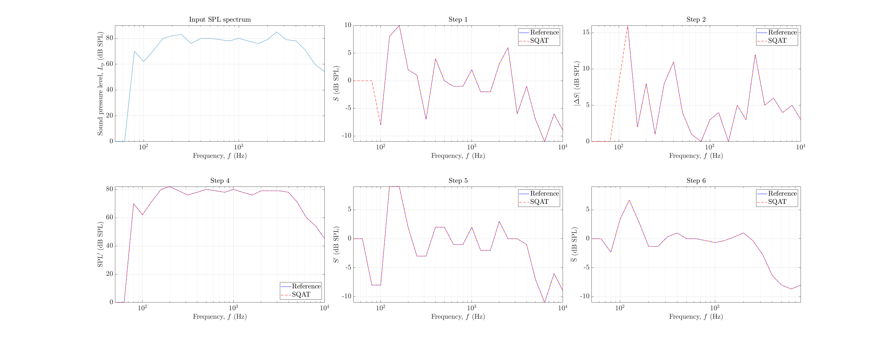
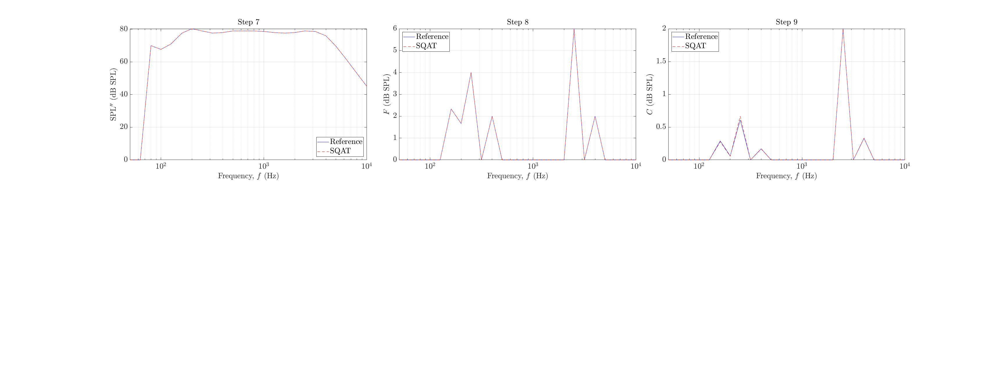

# About this code 
The `validation_tone_correction.m` code is used to verify if the calculation of the tone correction factor is being correctly performed in the Effective Perceived Noise Level (EPNL) code (see `EPNL_FAR_Part36` code [here](../../../psychoacoustic_metrics/EPNL_FAR_Part36/EPNL_FAR_Part36.m)). The verification is performed considering the reference values provided in Table 3.7 of Ref. [1].

# How to use this code
This is a standalone code. Therefore, no extra steps are required to run this code.

# Results
The figures below show the results obtained using the reference sound spectrum provided by Ref. [1] as input for the `get_PNLT` function implemented in SQAT (see function [here](../../../psychoacoustic_metrics/EPNL_FAR_Part36/helperFunctions/get_PNLT.m)), which computes the tone correction factor used for the final EPNL calculation. 

The results obtained using the code implemented in SQAT are compared with the reference values provided by Ref. [1] for each relevant step of the tone correction factor calculation. For more information about each particular step, please consult Refs. [1,2].

   

   

# References
[1] International Civil Aviation Organization (2015) Doc 9501, Environmental Technical Manual, Volume I, Procedures for the Noise Certification of Aircraft, Second Edition - ISBN 978-92-9249-721-7 (see Table 3.7) 

[2] Federal Aviation Regulations, 14 CFR Parts 36 and 91, Docket No. FAA-2003-16526; Amendment No. 36-26, 91-288, (2005). [https://www.ecfr.gov/current/title-14/appendix-Appendix%20A%20to%20Part%2036](https://www.ecfr.gov/current/title-14/appendix-Appendix%20A%20to%20Part%2036) (Last viewed 30 Oct 2023)

# Log
README.md created on 30.10.2023 by Gil Felix Greco

 
