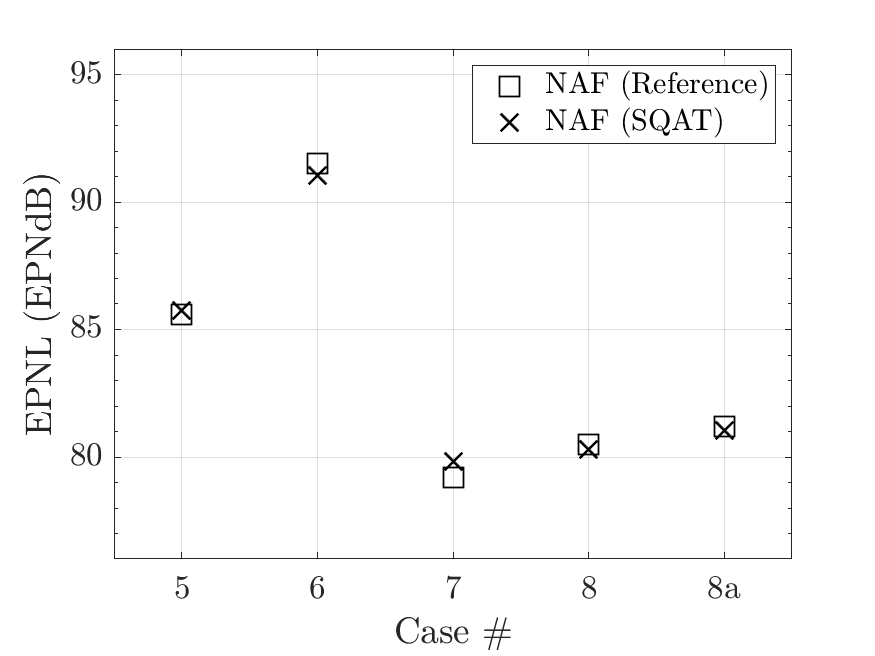
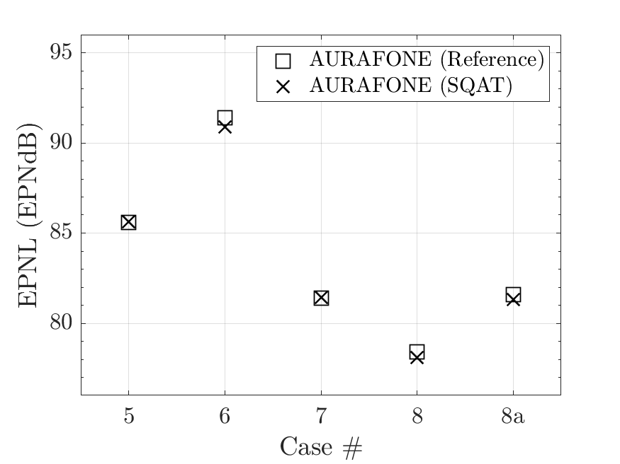
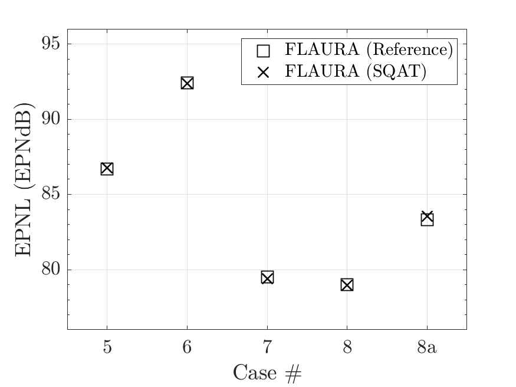

# About this code 

The `run_EPNL_cross_verification.m` code is used to perform a cross-verification between the EPNL results obtained using SQAT and EPNL values provided in the literature [1]. For this purpose, the `EPNL_FAR_Part36` code [here](../../../psychoacoustic_metrics/EPNL_FAR_Part36/EPNL_FAR_Part36.m)) is used to compute the EPNL from the (auralized) audio files provided as complementary data from Ref. [1]. They can be freely donwloaded from Ref. [2] (link) <a href="https://stabserv.larc.nasa.gov/flyover/?doing_wp_cron=1703067390.0725319385528564453125" target="_blank">here</a>. The verification is performed considering the reference values provided in Table 4 of Ref. [1].

# How to use this code
In order to run this code and reproduce the figures available in the `figs` folder, the user needs to download the dataset of sound files from Ref. [2] (link) <a href="https://stabserv.larc.nasa.gov/flyover/?doing_wp_cron=1703067390.0725319385528564453125" target="_blank">here</a>. The obtained folder called `AIAA-2020-2582_Sound_Files` has to be included in the `sound_files` folder of the toolbox (or loaded properly if the user wants to place them elsewhere).

# Results
In Ref. [1], three auralization tools, namely (1) NAF - NASA, (2) AURAFONE - EMPA and (3) FLAURA - ONERA, are used to auralize 5 cases of aircraft flyovers.

The figures below compare the EPNL results obtained using the `EPNL_FAR_Part36` implementation in SQAT, with the reference values provided in Table 4 of Ref. [1]. Additionally, absolute values from Ref. [1] are provided in Table 1 along with the relative difference EPNL values (SQAT minus Ref.). 

| NAF/NASA (Ref. [1] vs. SQAT)        | AURAFONE/Empa (Ref. [1] vs. SQAT)         |
|    |   |

| FLAURA/ONERA (Ref. [1] vs. SQAT)        | Table: EPNL values from Ref. [1] and differences [] relative to the EPNL value computed using SQAT (i.e. SQAT minus Ref.).|
|    | | Case # | NAF | AURAFONE | FLAURA |
|     :---:    |     :---:      |     :---:     |
| 5   | 85.6 [0.1]     | 85.6 [0.0]    | 86.7 [0.1]    |
| 6     | 91.5 [-0.5]       | 91.4 [-0.5]      | 92.4 [0.0]    |
| 7     | 79.2 [0.6]       | 81.4 [0.0]      | 79.5 [-0.1]    |
| 8     | 80.5 [-0.2]       | 78.4 [-0.3]      | 79.0 [0.0]    |
| 8a     | 81.2 [-0.2]       | 81.6 [-0.3]      | 83.3 [0.2]    | |

# References

[1] Rizzi, S. A., LeGriffon, I., Pieren, R., & Bertsch, L. (2020). A Comparison of Aircraft Flyover Auralizations by the Aircraft Noise Simulation Working Group. In AIAA AVIATION 2020 FORUM. doi: [10.2514/6.2020-2582](https://doi.org/10.2514/6.2020-2582)   

[1] [https://stabserv.larc.nasa.gov/flyover/?doing_wp_cron=1703067390.0725319385528564453125](https://stabserv.larc.nasa.gov/flyover/?doing_wp_cron=1703067390.0725319385528564453125) (Last viewed 20.12.2023)

# Log
README.md created on 20.12.2023 by Gil Felix Greco

 