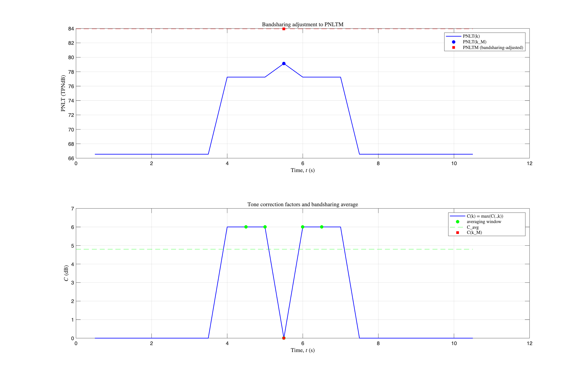

# About this code 
The `run_validation_bandsharing.m` code is used to verify if the bandsharing adjustment applied to the maximum tone-corrected perceived noise level PNLTM is being correctly performed in the Effective Perceived Noise Level (EPNL) code (see `EPNL_FAR_Part36` code [here](../../../psychoacoustic_metrics/EPNL_FAR_Part36/EPNL_FAR_Part36.m)). The verification is performed against the analytic formulation of Refs. [1,2]: whenever the tone correction factor at the time of the PNLT maximum is smaller than the average of the tone correction factors over the five consecutive spectra around the maximum, the adjustment `DeltaB = Cavg - C(kM)` shall be added, i.e. `PNLTM = PNLT(kM) + DeltaB`.

The tone correction factors C(k) themselves are verified separately in the [2_Tone_Correction_Factor](../2_Tone_Correction_Factor) folder (against Table 3.7 of Ref. [3]). Here the C(k) series is taken as given and the bandsharing arithmetic applied on top of it is what is verified.

The test uses synthetic one-third-octave spectra designed so that the bandsharing branch is triggered: the PNLT maximum occurs at a time step with a smooth spectrum (small tone correction at the peak) surrounded by time steps containing strong tones (large tone corrections around the peak). No external data is required.

# How to use this code
This code requires the `EPNL_FAR_Part36` function and its `get_PNLT` [helper](../../../psychoacoustic_metrics/EPNL_FAR_Part36/helper/get_PNLT.m) implemented in SQAT. Apart from that, no additional steps are required to run this code.

NOTE: this verification requires the bandsharing arithmetic as amended by PR #56 (`DeltaB = Cavg - Cmax(kM)`, subtraction). On versions prior to that amendment the DeltaB check fails by design.

# Results
The figure shows the PNLT curve with the bandsharing-adjusted PNLTM and the tone correction factors with the averaging window used to compute `Cavg`. All four checks must pass: (1) the synthetic spectra trigger the bandsharing branch, (2) `PNLTM = PNLT(kM) + (Cavg - C(kM))` within 1e-9 TPNdB, (3) `EPNL_FAR_Part36` reports the adjusted PNLTM, and (4) single-spectrum inputs skip the adjustment.

   

# References
[1] EASA, Environmental Protection Technical Specifications applicable to VTOL-capable aircraft powered by tilting rotors, Doc. No. TE.CERT.00075-002, section NVTOL-TILT.1105(d)(2), Issue 1, 12 Dec 2023. [https://www.easa.europa.eu/en/downloads/139024/en](https://www.easa.europa.eu/en/downloads/139024/en)

[2] Annex 16 to the Convention on International Civil Aviation, Environmental Protection, Volume I - Aircraft Noise, Eighth Edition, July 2017, Appendix 2, section 4.4.

[3] International Civil Aviation Organization (2015) Doc 9501, Environmental Technical Manual, Volume I, Procedures for the Noise Certification of Aircraft, Second Edition - ISBN 978-92-9249-721-7 (see Table 3.7)

# Log
README.md created on 31.08.2026 by Sergio Aguirre

