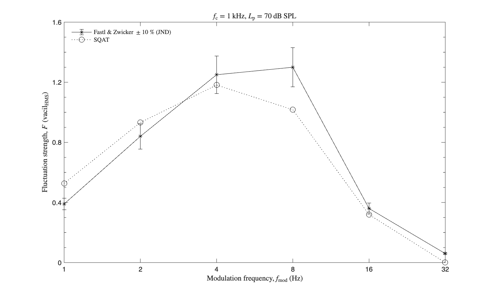

# About this code 
The `run_validation_FS_fmod.m` code is used to verify the implementation of the fluctuation strength model according to ECMA-418-2:2025 [1] (see `FluctuationStrength_ECMA418_2` code [here](../../../psychoacoustic_metrics/FluctuationStrength_ECMA418_2/FluctuationStrength_ECMA418_2.m)). The verification is performed considering the following test signals:

- Amplitude-modulated (AM) tones with carrier frequency $f_{\mathrm{c}}=1~\mathrm{kHz}$, modulation depth $m_{\mathrm{d}}=1$, and sound pressure level $L_{\mathrm{p}}=70~\mathrm{dB}~\mathrm{SPL}$ as a function of the modulation frequency $f_{\mathrm{mod}}$.  

# How to use this code
This code uses the same signals and reference values used for the validation of the fluctuation strength model implementation of Osses *et al.* ([link](../../../validation/FluctuationStrength_Osses2016/1_AM_tones_fmod)), which was performed in SQAT v1.0. In order to run the code and reproduce the figures available in the `figs` folder, the user needs to download the dataset of sound files from zenodo <a href="https://doi.org/10.5281/zenodo.7933206" target="_blank">here</a>. The obtained folder called `validation_SQAT_v1_0` has to be included in the `sound_files` folder of the toolbox. 

# Results
The figure below compares the results obtained using the `FluctuationStrength_ECMA418_2.m` implementation in SQAT with reference data obtained from Fastl & Zwicker [2]. The error bars express the fluctuation strength JND [2]. Results computed using SQAT correspond to the 90th percentile of the time-dependent fluctuation strength, as defined in ECMA-418-2:2025 (Section 9.1.14). 

    

# References
[1] Ecma International. (2025). Psychoacoustic metrics for ITT equipment - Part 2 (methods for describing human perception based on the Sottek Hearing Model) (Standard No. 418-2, 4th Edition/June 2025). [(link)](https://ecma-international.org/wp-content/uploads/ECMA-418-2_4th_edition_june_2025.pdf) (last viewed September 17, 2026)

[2] Fastl, H., & Zwicker, E. (2007). Psychoacoustics: facts and models, Third edition. Springer-Verlag. DOI: [10.1007/978-3-540-68888-4](https://doi.org/10.1007/978-3-540-68888-4)

# Log
Created by Sergio Aguirre and Gil Felix Greco (17.09.2026)
