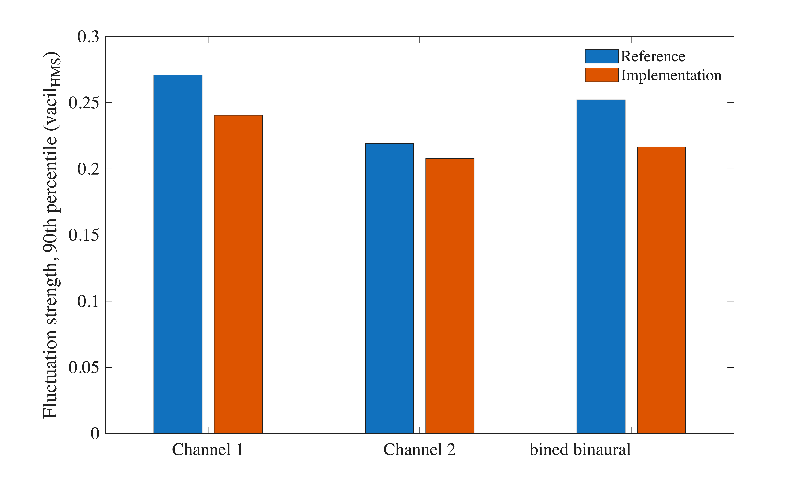
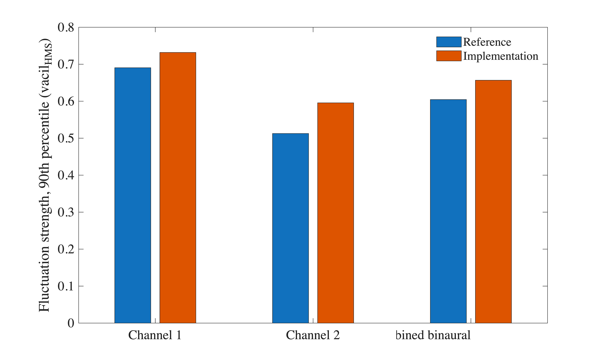

# About this code 
The `FluctuationStrength_ECMA418_2_software_comparison.m` code compares fluctuation strength results (ECMA-418-2 model [1]) obtained using a commercial software (ref. results) and using the implementation in SQAT (see `FluctuationStrength_ECMA418_2.m` code [here](../../../psychoacoustic_metrics/FluctuationStrength_ECMA418_2/FluctuationStrength_ECMA418_2.m)). Two binaural signals are used:

1) a binaural file recorded in a 'train station' environment (30 seconds, 2-channel binaural). The signal 'TrainStation.7.wav' was extracted from the EigenScape database [(link)](https://zenodo.org/doi/10.5281/zenodo.1012808), and trimmed between 01m00s and 01m30s. The EigenScape database, which is described by Green et al. [2], is licensed under Creative Commons Attribution 4.0.

2) an ambisonic recording of a 'park' environment with unmanned aircraft system (UAS / drone) flight overhead (25 seconds, 2-channel binaural). The signal 'Park.3.wav' was extracted from the EigenScape database and trimmed between 00m02s and 00m27s. The auralised UAS superimposed on the recording and the binaural re-recording are described in the folder of [pub_Lotinga2025_Forum_Acusticum_ECMA418_2](../../../publications/pub_Lotinga2025_Forum_Acusticum_ECMA418_2).

The reference results for both signals and for the three output channels (left ear, right ear and combined binaural) are stored in the `reference_results` folder. The ones of signal 2 are the fluctuation strength results of the verification dataset of Lotinga [4] (version 1.0.1, licensed under Creative Commons Attribution 4.0), renamed to the file names of this folder with their content unchanged. The ones of signal 1 were exported for this study: four of the six files are identical to the files of that dataset, and the two files of the time-dependent specific fluctuation strength carry it at half of the time resolution, each value being the larger of two consecutive values of the dataset.

# How to use this code
Signal 1, called `ExStereo_TrainStation7-0100-0130.wav`, is stored in the `sound_files/reference_signals` folder [(here)](../../../sound_files/reference_signals) and needs no download.

Signal 2, called `ExStereo_Park3-0002-0027_UAS.wav`, is stored in a dedicated zenodo repository (DOI: [10.5281/zenodo.15132459](https://doi.org/10.5281/zenodo.15132460)). After downloading the `pub_Lotinga2025_Forum_Acusticum_ECMA418_2` file from zenodo, unzip it and run the provided `copy_data_for_pub_Lotinga2025_to_SQAT.m` script to automatically place the necessary data in the correct folders. Alternatively, the `data` folder inside the downloaded `pub_Lotinga2025_Forum_Acusticum_ECMA418_2` file can be placed manually in the folder of that publication. When the file is absent, the code reports these instructions and moves on to the next signal, so signal 1 can be run on its own.

Results computed using SQAT correspond to the 90th percentile of the time-dependent fluctuation strength, as defined in ECMA-418-2:2025 (Section 9.1.14). The reference files carry the time series alone, so the code applies that same statistic to the reference, opening the window at the sample that `FluctuationStrength_ECMA418_2` uses for its own output, the floor of Section 9.1.12 included.

# Results
The lower tile of each time-dependent figure carries the absolute difference between the implementation and the reference, in the layout of the figures of Lotinga *et al.* [3]. The difference is taken on the time samples of the reference, where the implementation is interpolated linearly, because the two are exported on different time steps.

For the train station signal the implementation in SQAT reads below the reference, by 11.2 % and 5.1 % in the single values of channels 1 and 2, and for the park signal it reads above the reference, by 6.0 % and 16.2 %. In the four channels the rms difference relative to the reference is larger over the upper half of the reference values than over the lower half, so the two implementations part ways mostly where the fluctuation strength is large. The critical bands that read exactly zero largely coincide: of the 53 bands, the two implementations differ in three bands of channel 1 and two bands of channel 2 for the train station signal, and in two bands of channel 1 and none of channel 2 for the park signal. In SQAT those zeros come from the threshold of Section 9.1.10, which sets the values of $A(l,z)$ below 5.2519 to zero: without it, at most one band per channel stays at zero. The single values and the difference of the time series are reported below.

| | Channel 1 | Channel 2 | Combined binaural |
| --- | --- | --- | --- |
| **Train station**, reference (vacilHMS) | 0.2709 | 0.2191 | 0.2522 |
| **Train station**, SQAT (vacilHMS) | 0.2406 | 0.2079 | 0.2166 |
| **Train station**, rms difference (vacilHMS) | 0.0382 | 0.0177 | 0.0287 |
| **Train station**, max absolute difference (vacilHMS) | 0.1343 | 0.0660 | 0.1045 |
| **Park with UAS**, reference (vacilHMS) | 0.6906 | 0.5127 | 0.6045 |
| **Park with UAS**, SQAT (vacilHMS) | 0.7319 | 0.5957 | 0.6567 |
| **Park with UAS**, rms difference (vacilHMS) | 0.0578 | 0.0484 | 0.0501 |
| **Park with UAS**, max absolute difference (vacilHMS) | 0.2016 | 0.1974 | 0.1973 |

## Signal 1: train station

### Time-dependent fluctuation strength

| _TDep_FluctuationStrength.png) | _TDep_FluctuationStrength.png) |
| -------------- | -------------- |

### Time-averaged specific fluctuation strength

| _avgSpecific_FluctuationStrength.png) | _avgSpecific_FluctuationStrength.png) |
| -------------- | -------------- |

### Single values

### Time-dependent specific fluctuation strength

| _tDep_Specific_FluctuationStrength_ref.png) | _tDep_Specific_FluctuationStrength_implementation.png) |
| -------------- | -------------- |

| _tDep_Specific_FluctuationStrength_ref.png) | _tDep_Specific_FluctuationStrength_implementation.png) |
| -------------- | -------------- |

## Signal 2: park with UAS flight overhead

### Time-dependent fluctuation strength

| _TDep_FluctuationStrength.png) | _TDep_FluctuationStrength.png) |
| -------------- | -------------- |

### Time-averaged specific fluctuation strength

| _avgSpecific_FluctuationStrength.png) | _avgSpecific_FluctuationStrength.png) |
| -------------- | -------------- |

### Single values

### Time-dependent specific fluctuation strength

| _tDep_Specific_FluctuationStrength_ref.png) | _tDep_Specific_FluctuationStrength_implementation.png) |
| -------------- | -------------- |

| _tDep_Specific_FluctuationStrength_ref.png) | _tDep_Specific_FluctuationStrength_implementation.png) |
| -------------- | -------------- |

# References
[1] Ecma International. (2025). Psychoacoustic metrics for ITT equipment - Part 2 (methods for describing human perception based on the Sottek Hearing Model) (Standard No. 418-2, 4th Edition/June 2025). [(link)](https://ecma-international.org/wp-content/uploads/ECMA-418-2_4th_edition_june_2025.pdf) (last viewed September 18, 2026)

[2] Green, M. C., & Murphy, D. (2017). EigenScape: A Database of Spatial Acoustic Scene Recordings. Applied Sciences, 7(11), 1204. DOI: [10.3390/app7111204](https://doi.org/10.3390/app7111204)

[3] Lotinga, M., Torjussen, M., & Felix Greco, G. (2025). Verified implementations of the Sottek psychoacoustic hearing model standardised sound quality metrics (ECMA-418-2 loudness, tonality and roughness). Forum Acusticum.

[4] Lotinga, M. (2026). Dataset: Verification audio and processing results files for ECMA-418-2:2025 psychoacoustic sound quality metrics (version 1.0.1). Zenodo. DOI: [10.5281/zenodo.19090750](https://doi.org/10.5281/zenodo.19090750)

# Log
Created by Sergio Aguirre and Gil Felix Greco (18.09.2026)
