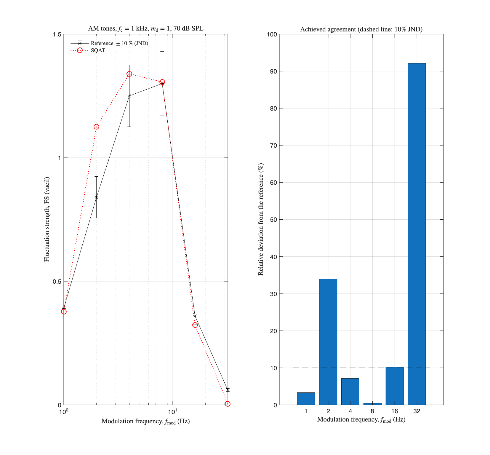

# About this code
The `run_verification_FS_anchor_regression.m` code is a self-contained verification gate for the implementation of the fluctuation strength model from Osses *et al.* [1] (see `FluctuationStrength_Osses2016` code [here](../../../psychoacoustic_metrics/FluctuationStrength_Osses2016/FluctuationStrength_Osses2016.m)). All test signals are generated inside the script (AM tones, $f_{\mathrm{c}}=1~\mathrm{kHz}$, $m_{\mathrm{d}}=1$, 4 s), so it runs directly after cloning the toolbox. The script raises an error if any check fails, so it can gate changes to the implementation when run in batch mode.

# Checks
Three layers, from definitional to statistical:

1. **Definitional anchor.** A 1 kHz tone at 60 dB SPL, 100% amplitude modulated at $f_{\mathrm{mod}}=4~\mathrm{Hz}$, yields 1 vacil by definition [1,2]. Tolerance: the fluctuation strength JND of 10% [2]. Current value: 1.019484 vacil.

2. **Regression pins.** The fluctuation strength of the six grid tones (70 dB SPL, $f_{\mathrm{mod}}=1$ to $32~\mathrm{Hz}$), of the anchor, and of one very loud signal (125 dB SPL, $f_{\mathrm{mod}}=4~\mathrm{Hz}$) is pinned to the current implementation within $10^{-4}$ vacil. The 125 dB SPL signal exercises the corrected masked assignment of the vectorised Terhardt filterbank: before that correction, any component above roughly 121 dB SPL crashed the computation, so this pin fails by design on implementations without the correction.

3. **Conformance statistics.** The grid is compared against the reference values of Ref. [1] used by [1_AM_tones_fmod](../1_AM_tones_fmod). The achieved RMSE of 0.1251 vacil is pinned, so agreement with the reference can only improve. The achieved state matches the published figure of that folder, including its two known outliers: the overshoot at $f_{\mathrm{mod}}=2~\mathrm{Hz}$ (1.13 computed against 0.84 measured) and the near-zero value at $f_{\mathrm{mod}}=32~\mathrm{Hz}$ (0.005 computed against 0.06 measured, a deviation of 0.055 vacil in absolute terms).

The JND is enforced as a hard criterion only at the anchor; applied point by point it would reject the published state of the implementation.

# Results

# References
[1] Osses, A., García, R., & Kohlrausch, A. (2016). Modelling the sensation of fluctuation strength. [Proceedings of Meetings on Acoustics](https://doi.org/10.1121/2.0000410), 28(1), 050005.

[2] Fastl, H., & Zwicker, E. (2007). Psychoacoustics: facts and models, Third edition. [Springer-Verlag](https://doi.org/10.1007/978-3-540-68888-4).

# Log
This code was added after SQAT v1.3 (see the discussion in issue #47).
