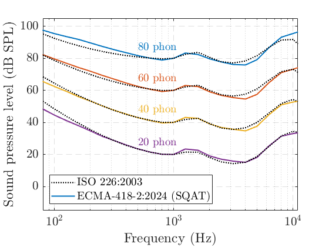

# About this code 
The `Loudness_ECMA418_2_equal_loudness_contours.m` code is used to reproduce Fig. A1 from [1], where the equal-loudness-level contours from ISO 226:2003 [2] are compared with isocontours obtained using the loudness model from ECMA-418-2 (see `Loudness_ECMA418_2.m` code [here](../../../psychoacoustic_metrics/Loudness_ECMA418_2/Loudness_ECMA418_2.m)). To perform this verification study, first the loudness of a 1-kHz tone is computed using the ECMA-loudness model. After that, the SPL of tones with different frequencies is adjusted so that they yield the same loudness of the 1-kHz tone. 

# How to use this code
The test signals are generated in the code. Therefore, no extra steps are required to run this code.

# Results

# References
[1] Ecma International. (2024). Psychoacoustic metrics for ITT equipment - Part 2 (methods for describing human perception based on the Sottek Hearing Model) (Standard No. 418-2, 3rd Edition/December 2024). [https://ecma-international.org/wp-content/uploads/ECMA-418-2_3rd_edition_december_2024.pdf](https://ecma-international.org/wp-content/uploads/ECMA-418-2_3rd_edition_december_2024.pdf) (Last viewed 22 Jan 2025)

[2] International Organization for Standardization. (2003). Acoustics - Normal equal-loudness-level contours (ISO Standard No. 226).

# Log
Created by Gil Felix Greco (26.01.2025)
Updated results: Gil Felix Greco (21.03.2025)

