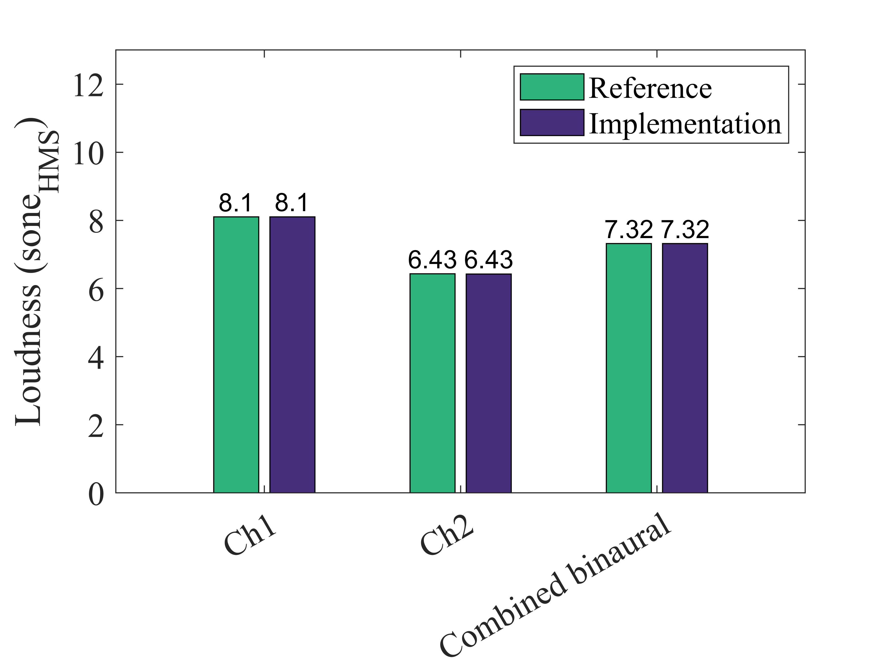

# About this code 

The `Loudness_ECMA418_2_software_comparison.m` code compares loudness results (ECMA-418-2 model [1]) obtained in a commercial software and using the implementation in SQAT (see `Loudness_ECMA418_2` code [here](../../../psychoacoustic_metrics/Loudness_ECMA418_2/Loudness_ECMA418_2.m)). 

<!-- Artemis Suite 15.7-->

# How to use this code
This is a standalone code. Therefore, no extra steps are required to run it.

# Results

## Time-dependent loudness

  

## Time-averaged specific loudness

  

## Overall loudness

# References
[1] Ecma International. (2024). Psychoacoustic metrics for ITT equipment - Part 2 (methods for describing human perception based on the Sottek Hearing Model) (Standard No. 418-2, 3rd Edition/December 2024). [https://ecma-international.org/wp-content/uploads/ECMA-418-2_3rd_edition_december_2024.pdf](https://ecma-international.org/wp-content/uploads/ECMA-418-2_3rd_edition_december_2024.pdf) (Last viewed 22 Jan 2025)

# Log
Created by Gil Felix Greco (31.01.2025)

