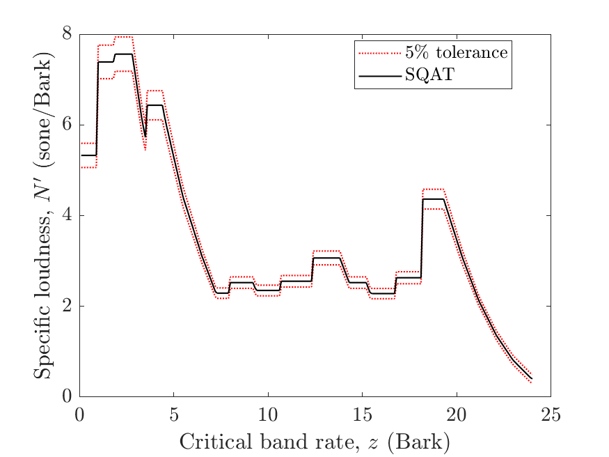
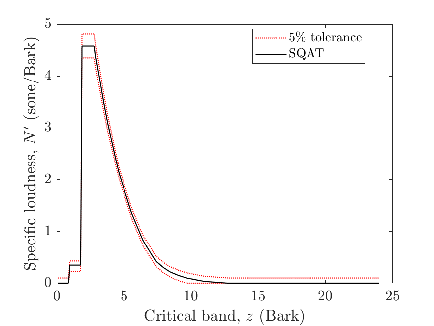
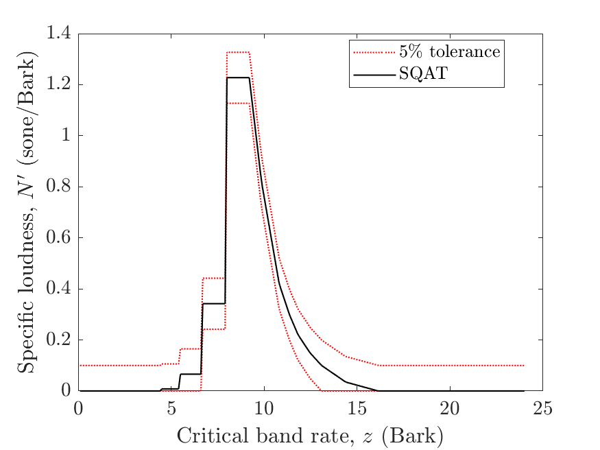
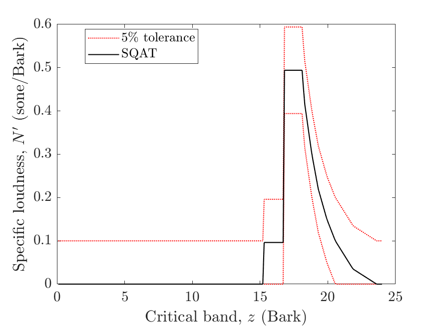

# About this code 
The `validation_stationary_loudness_synthetic_signals.m` code is used to verify the loudness implementation according to ISO 532-1 [1] (see `Loudness_ISO532_1`code [here](../../../psychoacoustic_metrics/Loudness_ISO532_1/Loudness_ISO532_1.m)). The verification of the stationary loudness method is performed considering the synthetic test sounds provided in the Annex B.2 and B.3 of the ISO standard. The test signals used here are the following:

- Test signal 1 (stationary loudness based on one-third-octave levels)
- Test signal 2 (pure tone,  $f_{\mathrm{c}}=250~\mathrm{Hz}$ and $L_{\mathrm{p}}=80~\mathrm{dB~SPL}$).
- Test signal 3 (pure tone, $f_{\mathrm{c}}=1~\mathrm{kHz}$ and $L_{\mathrm{p}}=60~\mathrm{dB~SPL}$).
- Test signal 4 (pure tone, $f_{\mathrm{c}}=4~\mathrm{kHz}$ and $L_{\mathrm{p}}=40~\mathrm{dB~SPL}$).
- Test signal 5 (pink noise, $L_{\mathrm{p}}=60~\mathrm{dB~SPL}$).

 Here, the center frequency $f_{\mathrm{c}}$ and sound pressure level $L_{\mathrm{p}}$ are used to describe the signals.

# How to use this code
In order to run this code and reproduce the figures available in the `figs` folder, the user needs to download the dataset of sound files from zenodo <a href="https://doi.org/10.5281/zenodo.7933206" target="_blank">here</a>. The obtained folder called `validation_SQAT_v1_0` has to be included in the `sound_files` folder of the toolbox. 

# Results
The figures below compare the results obtained using the `Loudness_ISO532_1` implementation in SQAT with the tolerance reference values from the ISO standard.

Test signal 1 (stationary loudness based on one-third-octave levels)  |  
:-------------------------:| 
  

| Test signal 2        | Test signal 3         |
| -------------- | -------------- |
|    |   |

|Test signal 4 | Test signal 5          |
| -------------- | -------------- |
|    |   |

# References
[1] International Organization for Standardization. (2017). Acoustics - Methods for calculating loudness - Part 1: Zwicker method (ISO Standard No. 532-1).

# Log
This code was released in SQAT v1.0, 14.05.2023

