# About this code 
The `validation_synthetic_signals_time_varying.m` code is used to verify the loudness implementation according to ISO 532-1 [1] (see `Loudness_ISO532_1`code [here](../../../psychoacoustic_metrics/Loudness_ISO532_1/Loudness_ISO532_1.m)). The verification of the time-varying loudness method is performed considering the synthetic test sounds provided in the Annex B.4 of the ISO standard:

- Test signal 6 (pure tone, $f_{\mathrm{c}}=250~\mathrm{Hz}$ and $L_{\mathrm{p}}=30-80~\mathrm{dB~SPL}$)
- Test signal 7 (pure tone, $f_{\mathrm{c}}=1~\mathrm{kHz}$ and $L_{\mathrm{p}}=30-80~\mathrm{dB~SPL}$)
- Test signal 8 (pure tone, $f_{\mathrm{c}}=4~\mathrm{kHz}$ and $L_{\mathrm{p}}=30-80~\mathrm{dB~SPL}$)
- Test signal 9 (pink noise, $L_{\mathrm{p}}=0-50~\mathrm{dB~SPL}$)
- Test signal 10 (10 ms tone pulse, $f_{\mathrm{c}}=1~\mathrm{kHz}$ and $L_{\mathrm{p}}=70~\mathrm{dB~SPL}$)
- Test signal 11 (50 ms tone pulse, $f_{\mathrm{c}}=1~\mathrm{kHz}$ and $L_{\mathrm{p}}=70~\mathrm{dB~SPL}$)
- Test signal 12 (500 ms tone pulse, $f_{\mathrm{c}}=1~\mathrm{kHz}$, $L_{\mathrm{p}}=70~\mathrm{dB~SPL}$)
- Test signal 13 (Combined tone pulses, $f_{\mathrm{c}}=1~\mathrm{kHz}$)

Here, the center frequency $f_{\mathrm{c}}$ and sound pressure level $L_{\mathrm{p}}$ are used to describe the signals.

# How to use this code
In order to run this code and reproduce the figures available in the `figs` folder, the user needs to download the dataset of sound files from zenodo <a href="https://doi.org/10.5281/zenodo.7933206" target="_blank">here</a>. The obtained folder called `validation_SQAT_v1_0` has to be included in the `sound_files` folder of the toolbox. 

# Results
The figures below compare the results obtained using the `Loudness_ISO532_1` implementation in SQAT with the tolerance reference values from the ISO standard. 

| Test signal 6   | Test signal 6 (specific loudness @ 2.5 Bark)         |
| -------------- | -------------- |
| 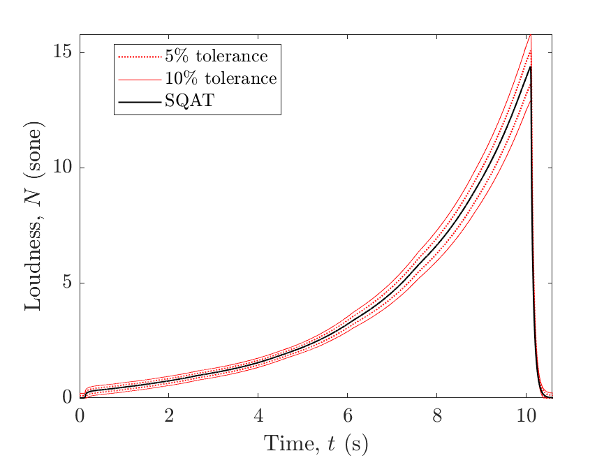   | 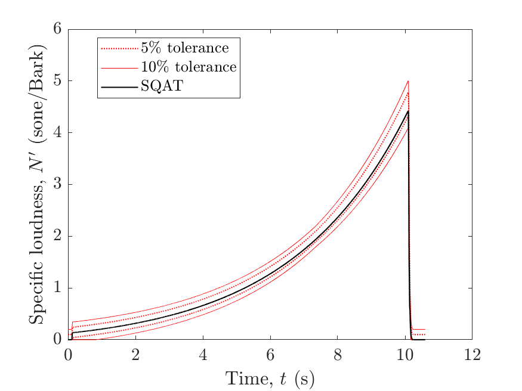  |

| Test signal 7   | Test signal 7 (specific loudness @ 8.5 Bark)        |
| -------------- | -------------- |
| 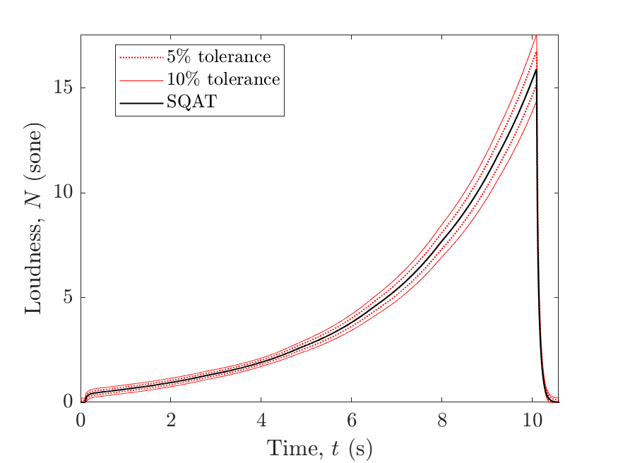   | 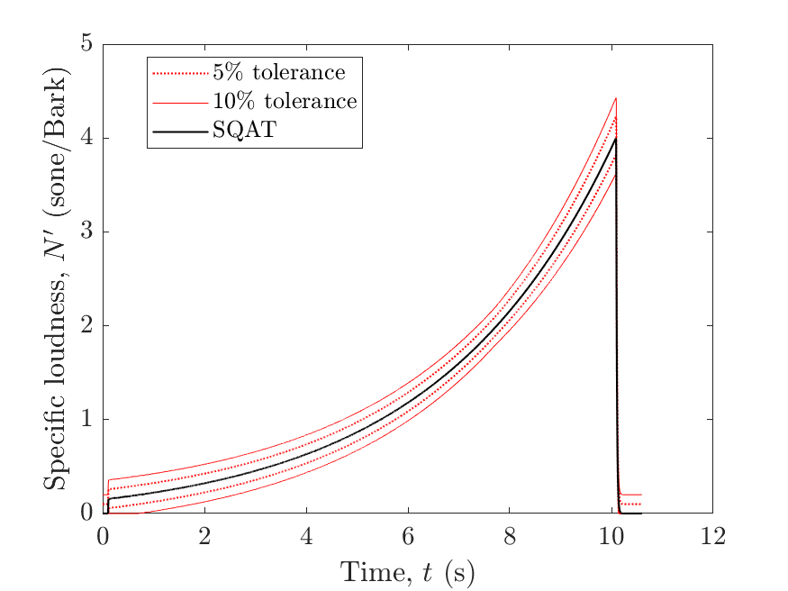  |

| Test signal 8    | Test signal 8 (specific loudness @ 17.5 Bark)         |
| -------------- | -------------- |
| 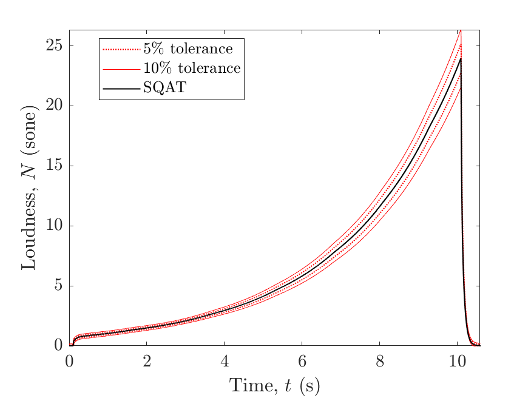   | 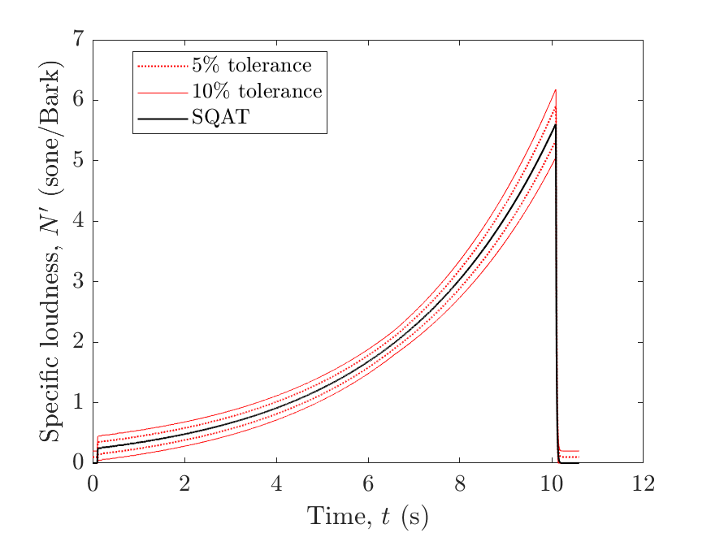  |

| Test signal 9    | Test signal 9 (specific loudness @ 17.5 Bark)         |
| -------------- | -------------- |
| 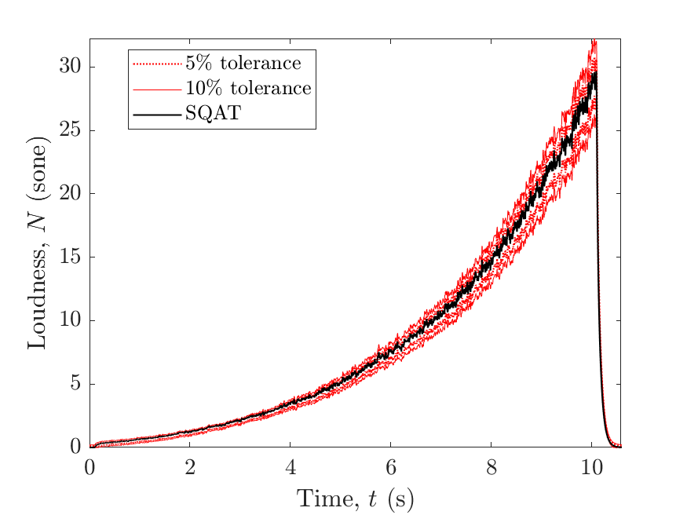   | 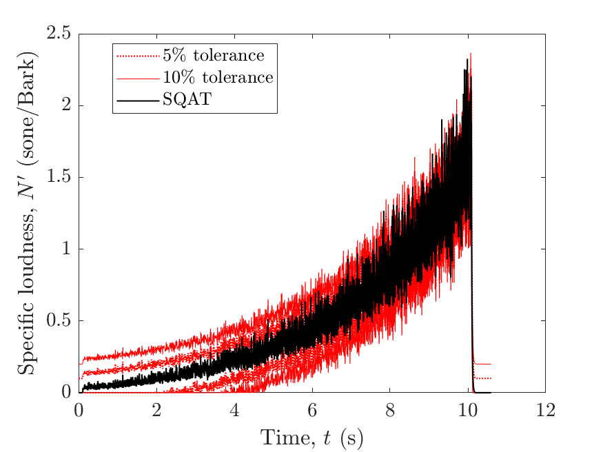  |

| Test signal 10   | Test signal 10 (specific loudness @ 8.5 Bark)         |
| -------------- | -------------- |
| 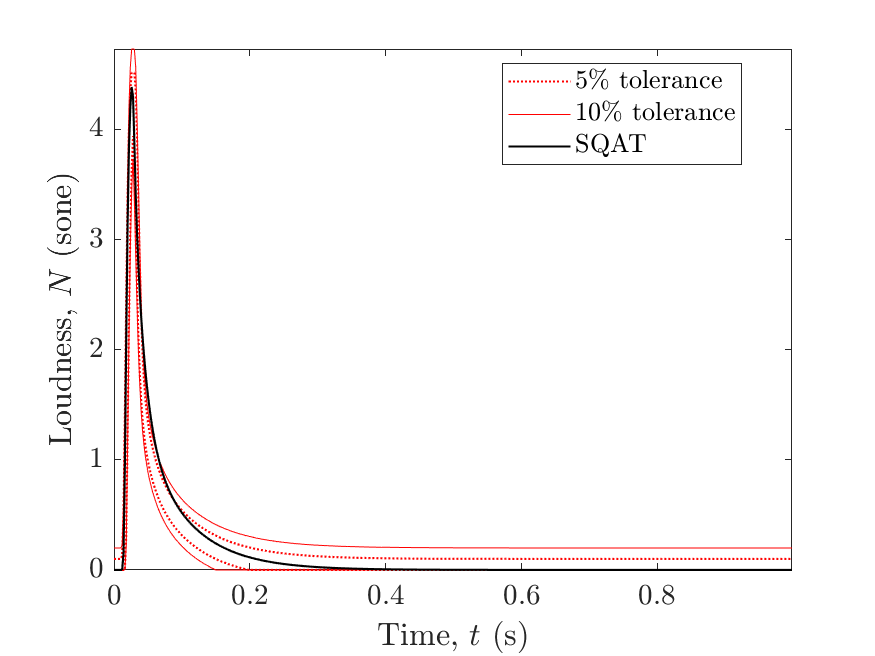   | 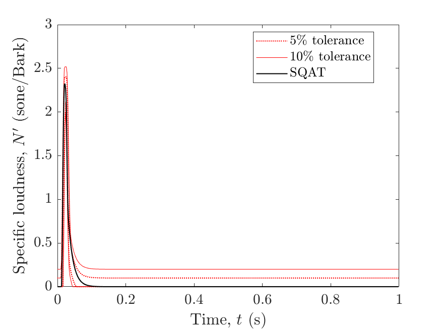  |

| Test signal 11   | Test signal 11 (specific loudness @ 8.5 Bark)       |
| -------------- | -------------- |
| 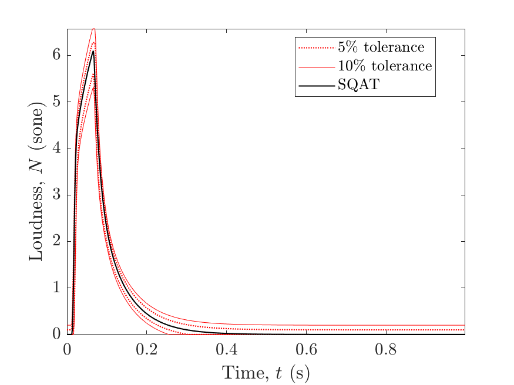   | 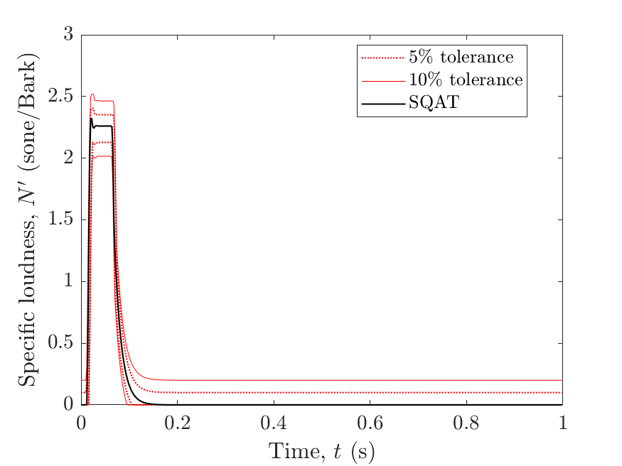  |

| Test signal 12    | Test signal 12 (specific loudness @ 8.5 Bark)         |
| -------------- | -------------- |
| 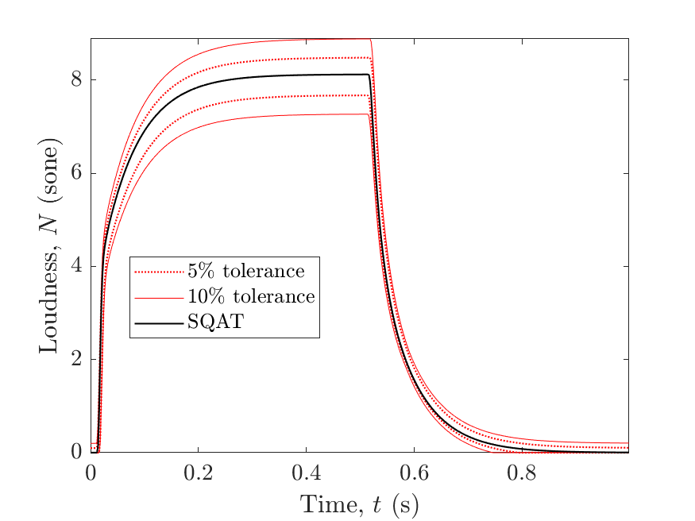   | 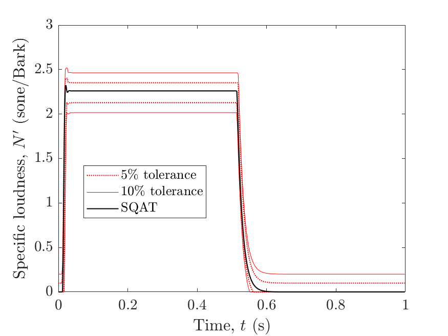  |

| Test signal 13    | Test signal 13 (specific loudness @ 8.5 Bark)        |
| -------------- | -------------- |
| 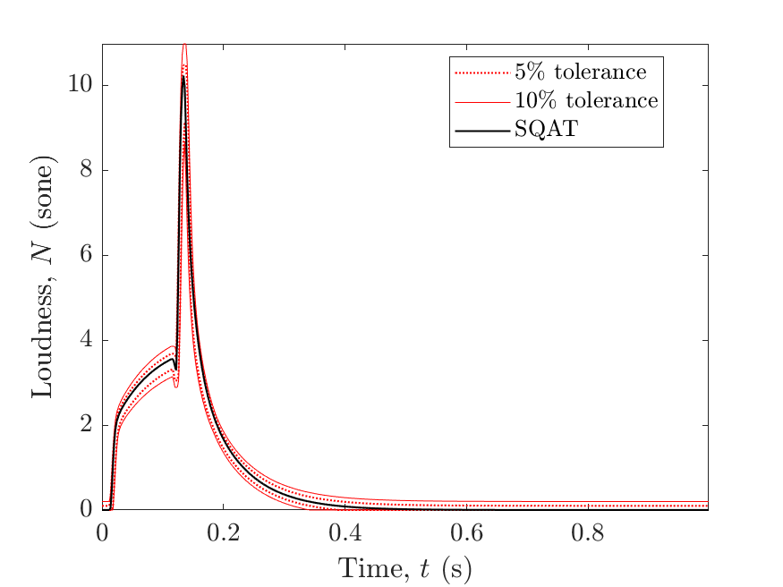   | 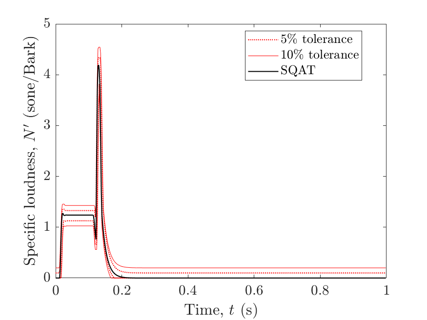  |

A summary presenting the differences (max. total loudness and 5\% percentile loudness) between calculated (SQAT) and reference values provided by ISO 532-1 is presented below for signals 6-13. The differences are not bigger than $\pm0.5$ sone for any signal of metric. Despite providing reference values, the ISO standard do not stipulates any tolerance values for synthetic time-varying signals in terms of those single-value indicators.

Summary of loudness differences for signals 6-13  |  
:-------------------------:| 
| 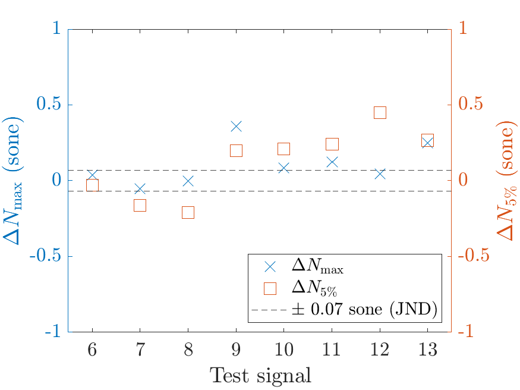|

# References
[1] International Organization for Standardization. (2017). Acoustics - Methods for calculating loudness - Part 1: Zwicker method (ISO Standard No. 532-1).

# Log
This code was released in SQAT v1.0, 14.05.2023

Summary of loudness differences included by Gil Felix Greco, 08.12.2024

