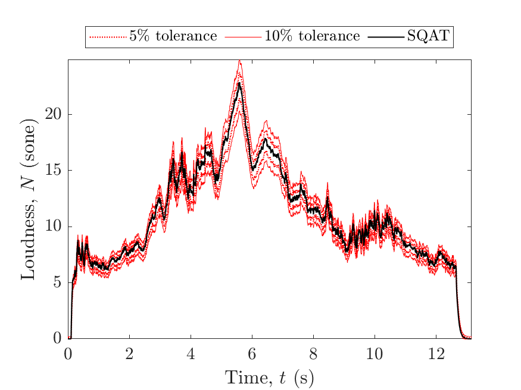
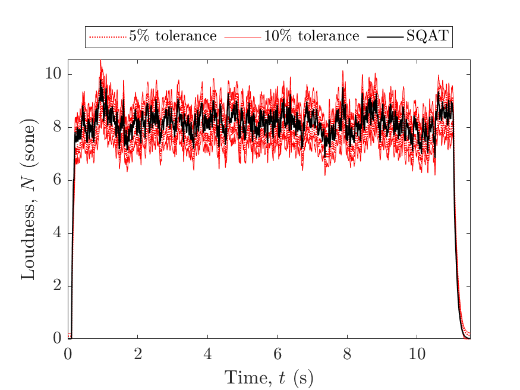
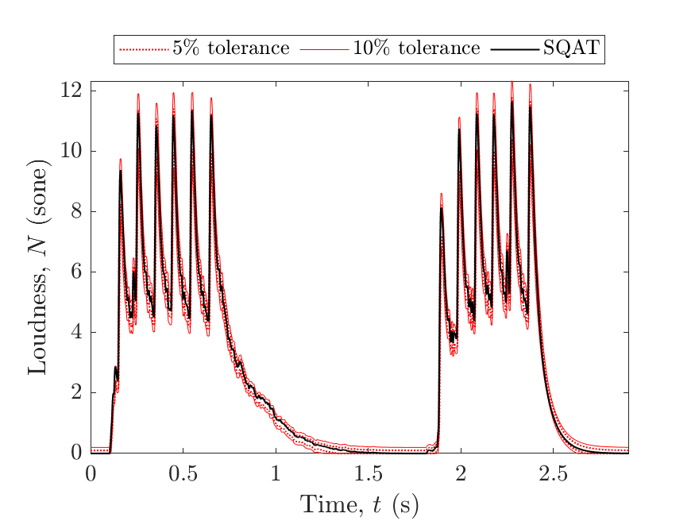
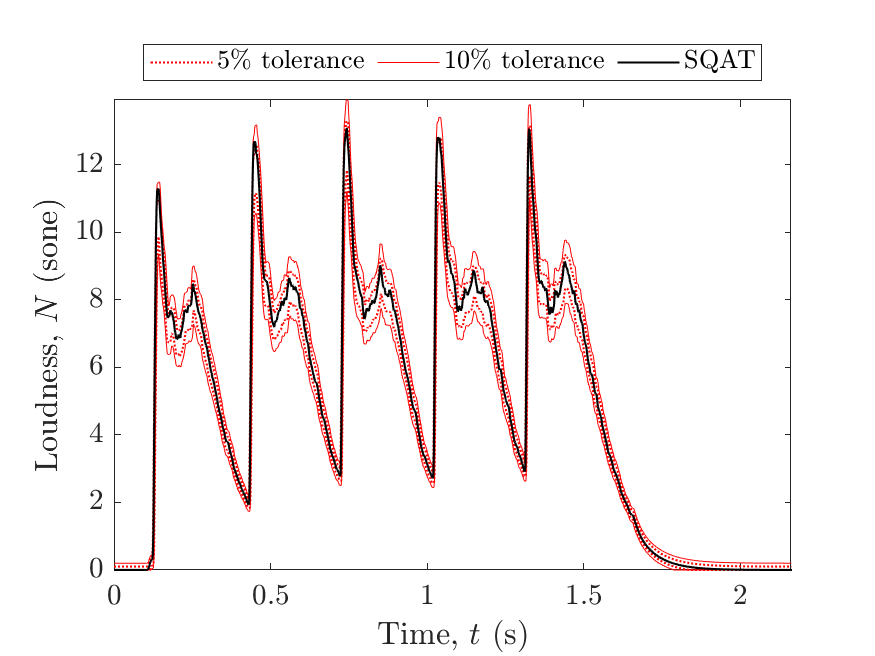
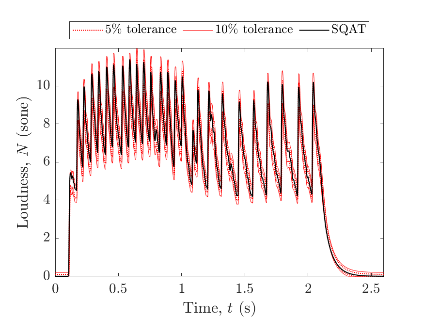
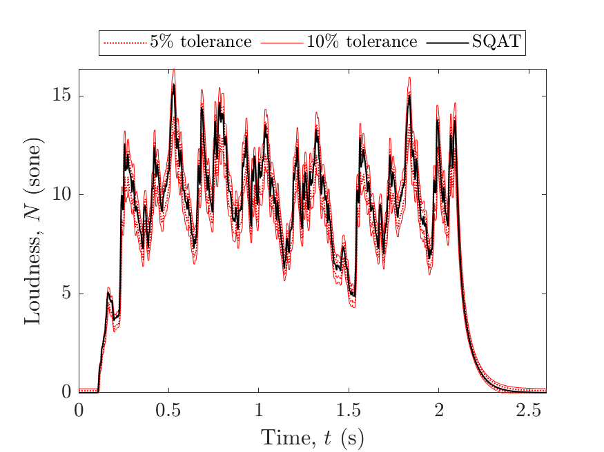
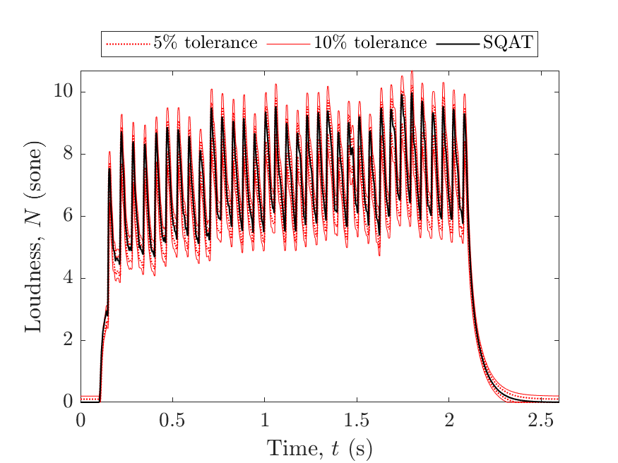
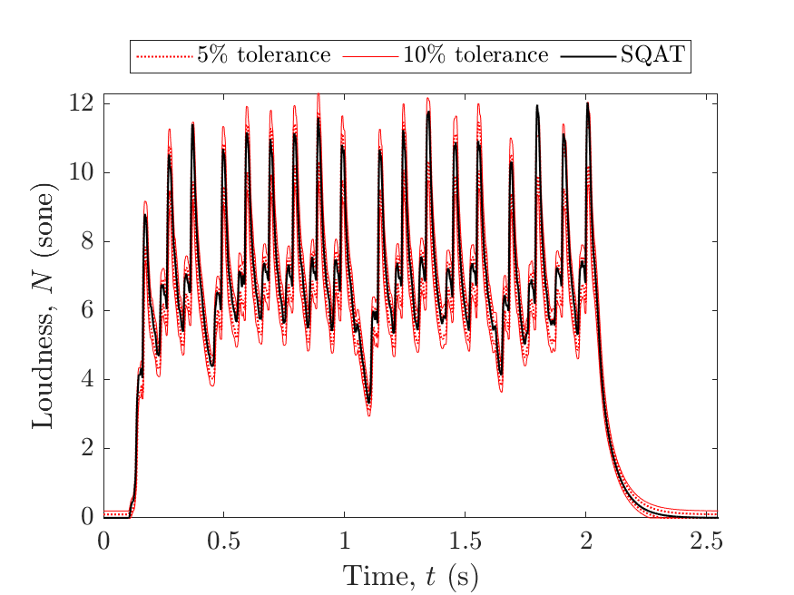
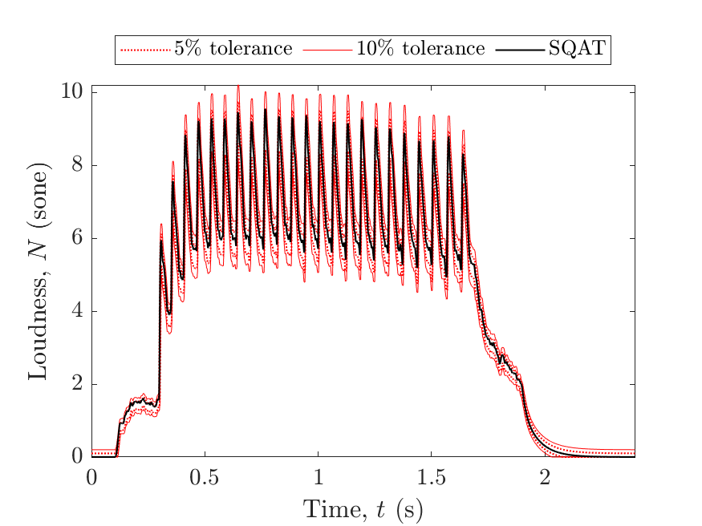
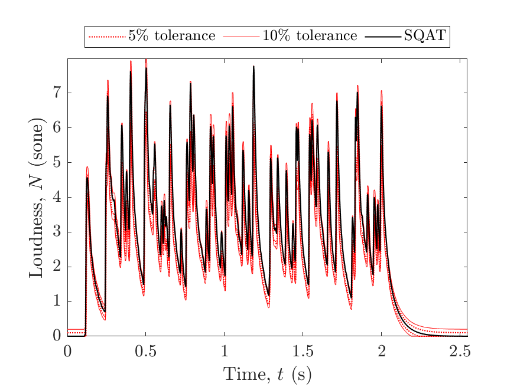

# About this code 
The `validation_technical_signals_time_varying.m` code is used to verify the loudness implementation according to ISO 532-1 [1] (see `Loudness_ISO532_1`code [here](../../../psychoacoustic_metrics/Loudness_ISO532_1/Loudness_ISO532_1.m)). The verification of the time-varying loudness method is performed considering the technical test sounds provided in the Annex B.5 of the ISO standard.

# How to use this code
In order to run this code and reproduce the figures available in the `figs` folder, the user needs to download the dataset of sound files from zenodo <a href="https://doi.org/10.5281/zenodo.7933206" target="_blank">here</a>. The obtained folder called `validation_SQAT_v1_0` has to be included in the `sound_files` folder of the toolbox. 

# Results
The figures below compare the results obtained using the `Loudness_ISO532_1` implementation in SQAT with the tolerance reference values from the ISO standard. 

| Test signal 14 (propeller-driven airplane).    | Test signal 15 (vehicle interior 40 kmh).         |
| -------------- | -------------- |
|    |  

| Test signal 16 (hairdryer).    | Test signal 17 (machine gun).         |
| -------------- | -------------- |
|    |  

| Test signal 18 (hammer).    | Test signal 19 (door creak).         |
| -------------- | -------------- |
|    |  

| Test signal 20 (shaking coins).    | Test signal 21 (jackhammer).         |
| -------------- | -------------- |
|    |  |

| Test signal 22 (ratchet wheel).    | Test signal 23 (typewriter).         |
| -------------- | -------------- |
|    |  |

| Test signal 24 (woodpecker).    | Test signal 25 (full can rattle).         |
| -------------- | -------------- |
|    |  |

# References
[1] International Organization for Standardization. (2017). Acoustics - Methods for calculating loudness - Part 1: Zwicker method (ISO Standard No. 532-1).

# Log
This code was released in SQAT v1.0, 14.05.2023

