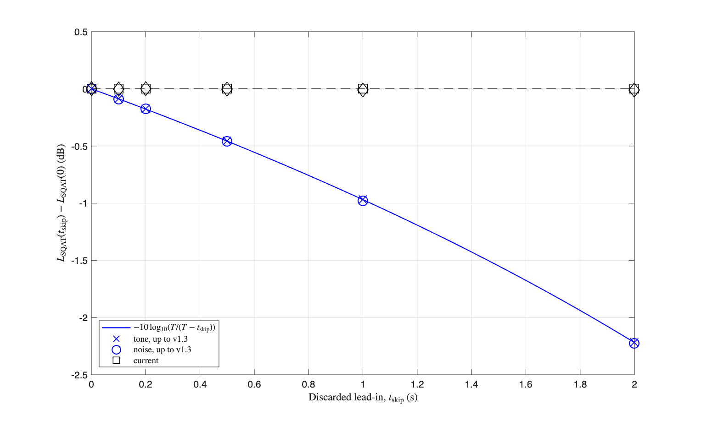

# Stationary loudness: dependence of the band levels on `time_skip`

The three verifications alongside this one drive `Loudness_ISO532_1` with the test signals of ISO 532-1 [1] and always with `time_skip = 0`. This one covers what happens when a non zero `time_skip` is requested from the stationary method, which is the way the examples shipped with the toolbox call it.

# Reference used

No measured data is needed here, because both properties verified hold by definition. This verification is self-contained: it generates every signal it uses and runs straight after cloning the toolbox.

**Anchor.** ISO 532-1 fixes the loudness of a 1 kHz free field tone at 40 dB SPL at 1 sone. That single point calibrates the whole scale, so it is the natural absolute reference for the stationary method.

**Invariance.** `time_skip` discards the leading part of the signal before the band levels are computed. For a stationary signal every retained window carries the same mean square, so the computed level and the computed loudness must stay the same however much was discarded. Any dependence on `time_skip` is an error of the implementation.

# Method

Two stationary signals are generated, both at an overall level of 40 dB SPL: a 1 kHz tone, which is also the anchor, and white noise. Each is analysed with `field = 0` and `method = 1`, for `time_skip` of 0, 0.1, 0.2, 0.5, 1 and 2 seconds on a signal of 5 seconds. The tolerance is 0.05 dB on the level invariance and 0.02 sone on the anchor.

# Results

| Dependence of the computed level on the discarded lead-in |
| -------------- |
|  |

The reference C code supplied with ISO 532-1 sums samples `NumSkip` to `NumSamples-1` and divides by the number of samples actually summed, `NumSamples-NumSkip` (see `f_square_and_smooth` in `ISO_532-1.c`). Dividing by the full signal length instead scales the mean square by `(NumSamples-NumSkip)/NumSamples`, which lowers every one of the 28 band levels by

```
10*log10( T / (T - time_skip) )   dB
```

uniformly, where `T` is the signal duration. The values produced up to v1.3 fall on that curve for both signals, which identifies the deviation as this scaling and nothing else.

The consequence for the reported loudness, on the 5 s signals used here:

| `time_skip` | 0 | 0.1 | 0.2 | 0.5 | 1.0 | 2.0 |
| --- | --- | --- | --- | --- | --- | --- |
| level deviation up to v1.3, dB | 0.000 | -0.085 | -0.175 | -0.455 | -0.967 | -2.216 |
| anchor tone up to v1.3, sone | 1.000 | 0.994 | 0.987 | 0.966 | 0.929 | 0.842 |
| anchor tone, current, sone | 1.000 | 1.000 | 1.000 | 1.000 | 1.000 | 1.000 |

The deviation vanishes at `time_skip = 0`, which is the value every other verification in this folder uses, so it stayed invisible until a non zero `time_skip` was verified. The examples shipped with the toolbox do use a non zero value: [`ex_Loudness_ISO532_1`](../../../examples/Loudness_ISO532_1/ex_Loudness_ISO532_1.m) and [`ex_Sharpness_DIN45692_from_loudness`](../../../examples/Sharpness_DIN45692/ex_Sharpness_DIN45692_from_loudness.m) both call the stationary method with `time_skip = 0.5` on a 5 s signal, so they carried a level error of 0.458 dB.

With the current implementation the largest deviation across both signals and all six values of `time_skip` is 0.010 dB, and the anchor is reproduced within 0.0002 sone.

# References
[1] International Organization for Standardization. (2017). Acoustics - Methods for calculating loudness - Part 1: Zwicker method (ISO Standard No. 532-1).

# Log
- This verification was released in SQAT v2.0 (Sergio Aguirre, 23.08.2026)
