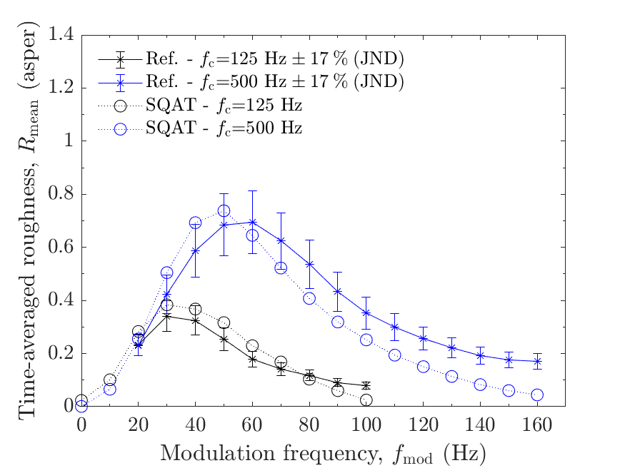
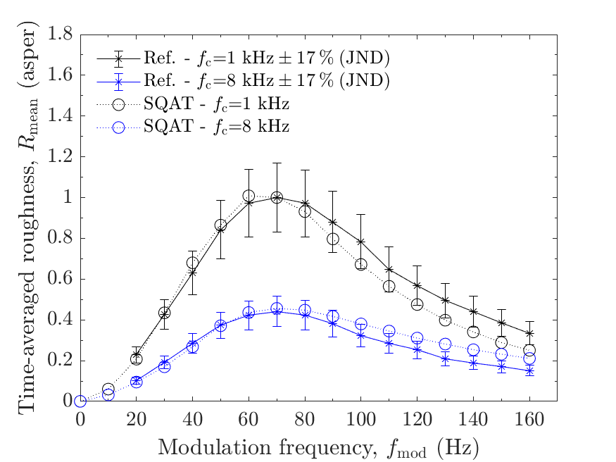
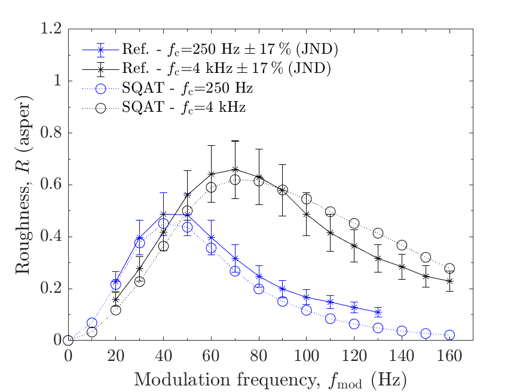
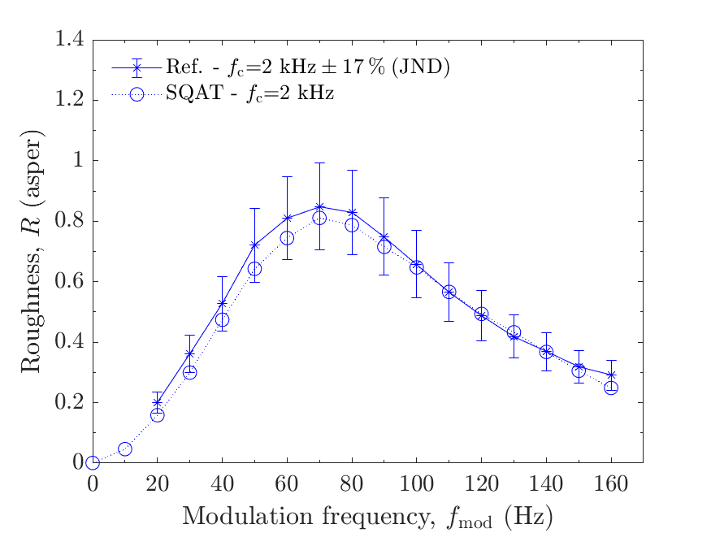

# About this code 
The `run_validation_roughness_fmod.m` code is used to verify the `Roughness_Daniel1997` implementation (see code [here](../../../psychoacoustic_metrics/Roughness_Daniel1997/Roughness_Daniel1997.m)) of the roughness model from Daniel & Weber [1]. The verification is performed considering amplitude-modulated tones with modulation depth $m_{\mathrm{d}}=1$, sound pressure level $L_{\mathrm{p}}=60~\mathrm{dB}~\mathrm{SPL}$ and different carrier frequencies $f_{\mathrm{c}}=[125, 250, 500, 1000, 2000, 4000, 8000] ~\mathrm{Hz}$ as a function of the modulation frequency $f_{\mathrm{mod}}$.  

# How to use this code
In order to run this code and reproduce the figures available in the `figs` folder, the user needs to download the dataset of sound files from zenodo <a href="https://doi.org/10.5281/zenodo.7933206" target="_blank">here</a>. The obtained folder called `validation_SQAT_v1_0` has to be included in the `sound_files` folder of the toolbox. 

# Results
The figures below compare the results obtained using the `Roughness_Daniel1997` implementation in SQAT with reference data obtained from listening tests [1]. The error bars express the roughness JND [2]. Results computed using SQAT correspond to the time-averaged roughness $R$.   
  
|        |        |
| -------------- | -------------- |
|    |   |

It should be noted that the differences between the reference data and the `Roughness_Daniel1997` implementation are similar to the ones presented by the original implementation of Daniel & Weber (see Ref. [1], Fig. 3). Therefore, it is not clear if the differences are due to a limitation of the Daniel & Weber's model itself or attributed to the specific implementation in SQAT.

# References
[1] Daniel, P., & Weber, R. (1997). Psychoacoustical Roughness: Implementation of an Optimized Model. [Acta Acustica united with Acustica](https://www.ingentaconnect.com/content/dav/aaua/1997/00000083/00000001/art00020), 83(1), 113-123.

[2] Fastl, H., & Zwicker, Z. (2007). Psychoacoustics: facts and models, Third edition. [Springer-Verlag](https://doi.org/10.1007/978-3-540-68888-4).

# Log
This code was released in SQAT v1.0, 14.05.2023

