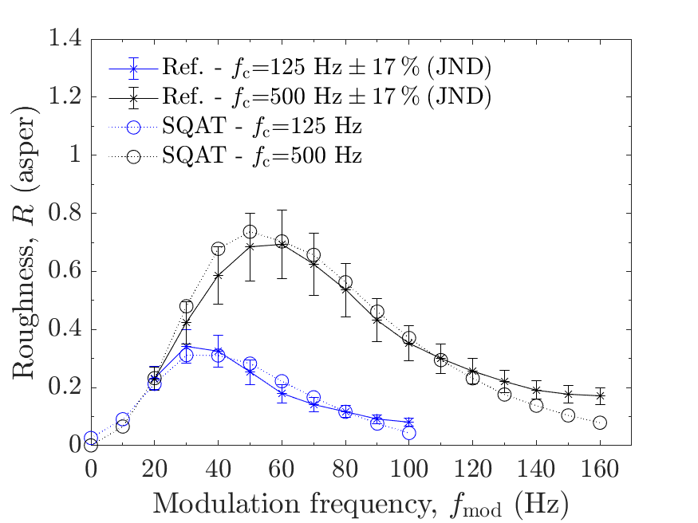
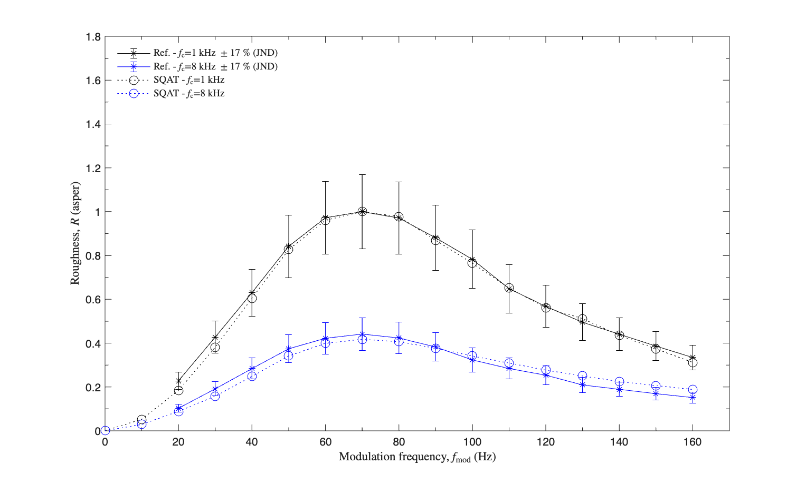
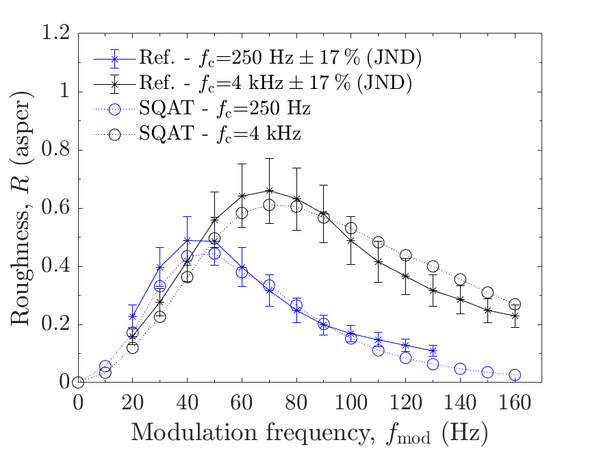
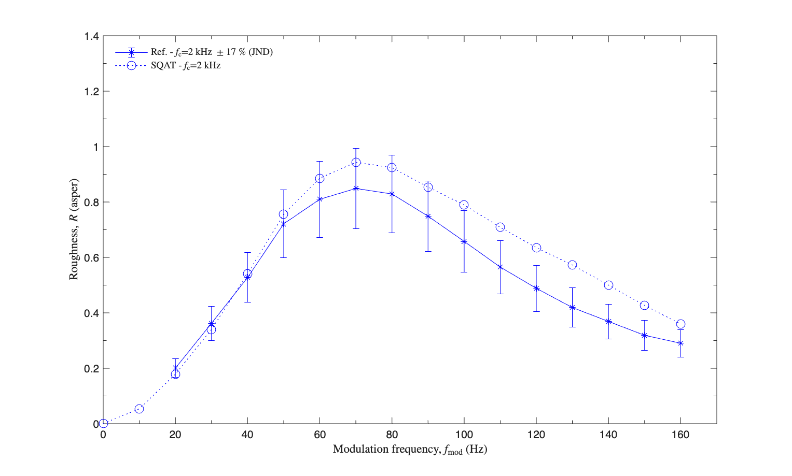

# About this code 
The `run_validation_roughness_fmod.m` code is used to verify the implementation of the roughness model from Daniel & Weber [1] (see `Roughness_Daniel1997` code [here](../../../psychoacoustic_metrics/Roughness_Daniel1997/Roughness_Daniel1997.m)). The verification is performed considering the following test signals:

- Amplitude-modulated (AM) tones with modulation depth $m_{\mathrm{d}}=1$, sound pressure level $L_{\mathrm{p}}=60~\mathrm{dB}~\mathrm{SPL}$ and different carrier frequencies $f_{\mathrm{c}}=[125, 250, 500, 1000, 2000, 4000, 8000] ~\mathrm{Hz}$ as a function of the modulation frequency $f_{\mathrm{mod}}$.  

# How to use this code
In order to run this code and reproduce the figures available in the `figs` folder, the user needs to download the dataset of sound files from zenodo <a href="https://doi.org/10.5281/zenodo.7933206" target="_blank">here</a>. The obtained folder called `validation_SQAT_v1_0` has to be included in the `sound_files` folder of the toolbox. 

# Results
The figures below compare the results obtained using the `Roughness_Daniel1997` implementation in SQAT with reference data obtained from listening tests [1]. The error bars express the roughness JND [2]. Results computed using SQAT correspond to time-averaged roughness values $R$.   
  
|        |        |
| -------------- | -------------- |
|    |   |

The differences between the reference data and the `Roughness_Daniel1997` implementation are of the same size as the ones of the original implementation of Daniel & Weber (see Ref. [1], Fig. 3). They are a property of the model: run point by point against the corrected implementation that Dik Hermes provided to the SQAT team in 2025, the two agree within 0.041 asper over a grid of 105 AM tones (7 carriers, 15 modulation frequencies, 60 dB SPL), with a median difference of 0.002 asper, so the implementation sits at the ceiling that the model itself sets.

Root mean square deviation from the reference data of Ref. [1], per carrier, in asper:

| carrier | v1.x | current |
| -- | -- | -- |
| 125 Hz | 0.044 | 0.027 |
| 250 Hz | 0.048 | 0.040 |
| 500 Hz | 0.100 | 0.049 |
| 1 kHz | 0.072 | 0.021 |
| 2 kHz | 0.041 | 0.101 |
| 4 kHz | 0.061 | 0.056 |
| 8 kHz | 0.045 | 0.029 |
| mean | 0.059 | 0.046 |

Six of the seven carriers improve. The median relative deviation over the points above 0.1 asper falls from 13.7 % to 9.4 %, and the number of points outside the 17 % JND band falls from 42 to 30 out of 94. The 2 kHz carrier moves the other way: there the corrected model overshoots the listening-test data around its maximum, and the implementation of Hermes shows the same behaviour.

# References
[1] Daniel, P., & Weber, R. (1997). Psychoacoustical Roughness: Implementation of an Optimized Model. [Acta Acustica united with Acustica](https://www.ingentaconnect.com/content/dav/aaua/1997/00000083/00000001/art00020), 83(1), 113-123.

[2] Fastl, H., & Zwicker, E. (2007). Psychoacoustics: facts and models, Third edition. [Springer-Verlag](https://doi.org/10.1007/978-3-540-68888-4).

# Log
This code was released in SQAT v1.0, 14.05.2023

Figures and results recomputed in September 2026, after the correction of the model implementation (see the log of `Roughness_Daniel1997.m` and issue 47).

