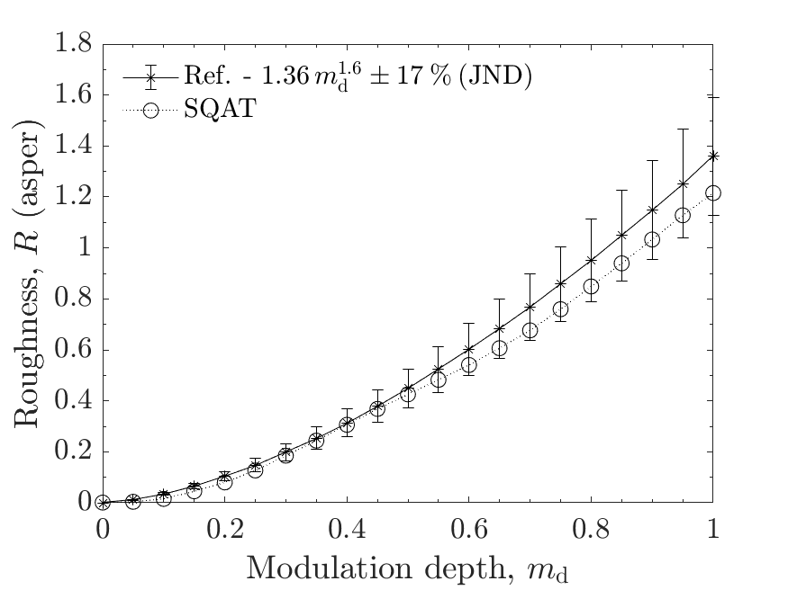

# About this code 
The `run_verification_roughness_modulation_depth.m` code is used to verify the implementation of the roughness model from Daniel & Weber [1] (see `Roughness_Daniel1997` code [here](../../../psychoacoustic_metrics/Roughness_Daniel1997/Roughness_Daniel1997.m)). The verification is performed considering the following test signals:

- Amplitude-modulated (AM) tones with carrier frequency $f_{\mathrm{c}}=1~\mathrm{kHz}$, modulation frequency $f_{\mathrm{mod}}=70~\mathrm{Hz}$ and sound pressure level $L_{\mathrm{p}}=70~\mathrm{dB}~\mathrm{SPL}$ as a function of the modulation depth $m_{\mathrm{d}}$. The AM tones follow Eq. (1) of [1], $p(t) = p_{0}\left[1 + m_{\mathrm{d}}\cos(2\pi f_{\mathrm{mod}}t)\right]\cos(2\pi f_{\mathrm{c}}t)$, so that $m_{\mathrm{d}}$ corresponds to the modulation index used in the reference literature.

# How to use this code
This code is self-contained. The test signals are generated locally by a function at the end of the script, so the dataset of sound files from zenodo is **not** required for this verification case. Simply run the script to reproduce the figure available in the `figs` folder.

# Results
The figure below compares the results obtained using the `Roughness_Daniel1997` implementation in SQAT with the power law $R = 1.36\,m_{\mathrm{d}}^{1.6}$ reported by Daniel & Weber [1] for this test condition (see Fig. 5 of [1]). The exponent 1.6 and the roughness JND of 17 %, expressed by the error bars, are reported by Fastl & Zwicker [2]. Results computed using SQAT correspond to time-averaged roughness values $R$.   

# References
[1] Daniel, P., & Weber, R. (1997). Psychoacoustical Roughness: Implementation of an Optimized Model. [Acta Acustica united with Acustica](https://www.ingentaconnect.com/content/dav/aaua/1997/00000083/00000001/art00020), 83(1), 113-123.

[2] Fastl, H., & Zwicker, E. (2007). Psychoacoustics: facts and models, Third edition. [Springer-Verlag](https://doi.org/10.1007/978-3-540-68888-4).

# Log
This code was released in SQAT v1.0, 14.05.2023

Figures recomputed in September 2026, after the correction of the model implementation (see the log of `Roughness_Daniel1997.m` and issue 47).

**Test conditions corrected in September 2026.** The version released in SQAT v1.0 used the wrong test conditions: the signals were generated at 60 dB SPL instead of 70 dB SPL (with the reference curve anchored at 1 asper instead of 1.36 asper), and the AM tones were generated with a modulation index of $m_{\mathrm{d}}/(2-m_{\mathrm{d}})$ instead of $m_{\mathrm{d}}$. Results published from the v1.0 version of this verification are superseded. The full description of both errors is given in the header of `run_verification_roughness_modulation_depth.m`. Only this verification case is affected; the other roughness validation cases use $m_{\mathrm{d}}=1$ or FM and noise signals, and remain valid as published.

**Test signals.** These are now generated locally by the script. The zenodo dataset (https://doi.org/10.5281/zenodo.7933206) has deliberately **not** been updated: `vary_modulation_depth.mat` still contains the erroneous 60 dB SPL signals and is kept unchanged so that the SQAT v1.0 record remains reproducible as published.