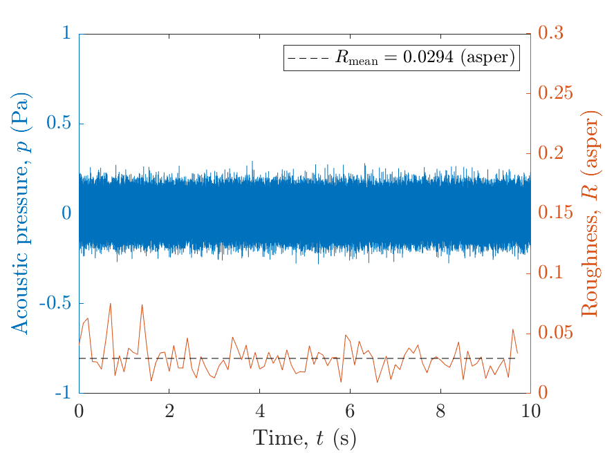
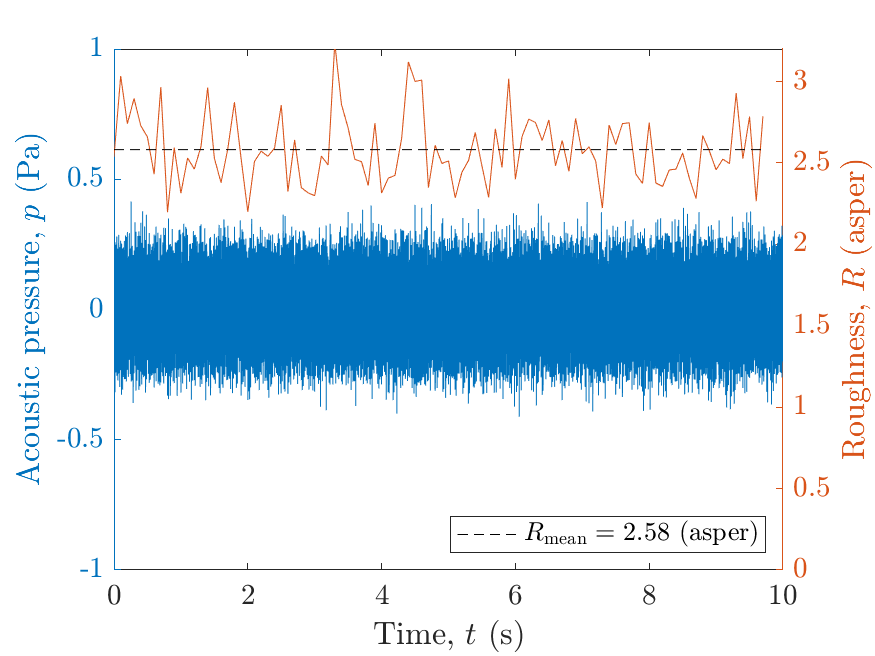

# About this code 
The `run_verification_modulated_white_noise.m` and `run_verification_white_noise.m` codes are used to verify the `Roughness_Daniel1997` implementation (see code [here](../../../psychoacoustic_metrics/Roughness_Daniel1997/Roughness_Daniel1997.m)) of the roughness model from Daniel & Weber [1] for unmodulated and amplitude-modulated (AM) white noise, respectively, with the following parameters: 

- unmodulated white noise: rms sound pressure level $L_{\mathrm{p,rms}}=70~\mathrm{dB}~ \mathrm{SPL}$; and 
- AM white noise: $f_{\mathrm{mod}}=70~\mathrm{Hz}$, modulation depth $m_{\mathrm{d}}=1$ and rms sound pressure level $L_{\mathrm{p,rms}}=70~\mathrm{dB}~ \mathrm{SPL}$.

# How to use this code
The signals are generated within the codes. Therefore, the user should be able to use it without any prior requirements other than the `Roughness_Daniel1997` implementation. 

# Results
One aspect of the roughness model from Daniel & Weber concerns its ability to calculate small roughness values ($\ll 1~\mathrm{asper}$) correctly. According to [1], unmodulated white noise produces little or no subjective roughness while the roughness threshold is close to $\approx 0.07~\mathrm{asper}$. For this type of signal, the roughness value calculated by the original model implementation is $\approx 0.02~\mathrm{asper}$ [1]. For a AM white-noise, the value calculated by the original model is reported to be $\approx 3~\mathrm{asper}$ [1].

The figure below presents the results obtained using the `Roughness_Daniel1997` implementation in SQAT.   

 Unmodulated white noise | AM white noise 
 | -------------- | -------------- |
|       |        |
 

# References
[1] Daniel, P., & Weber, R. (1997). Psychoacoustical Roughness: Implementation of an Optimized Model. [Acta Acustica united with Acustica](https://www.ingentaconnect.com/content/dav/aaua/1997/00000083/00000001/art00020), 83(1), 113-123.

# Log
This code was released in SQAT v1.0, 14.05.2023

