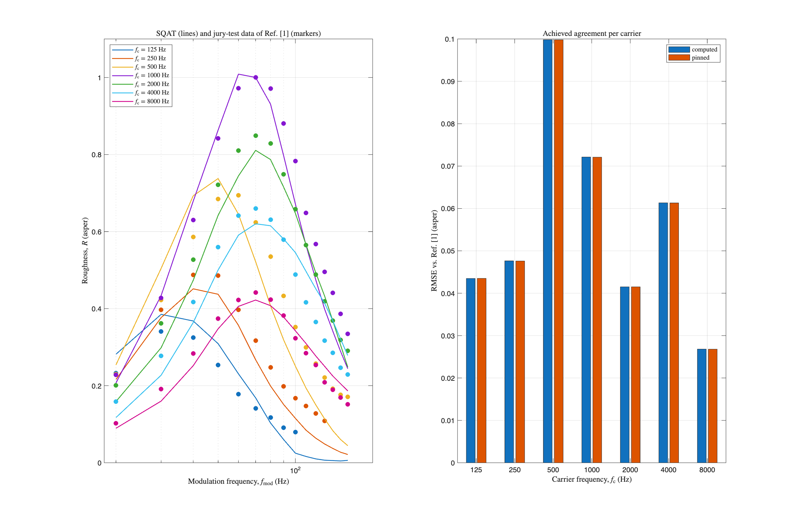

# About this code
The `run_verification_roughness_anchor_regression.m` code is a self-contained verification gate for the implementation of the roughness model from Daniel & Weber [1] (see `Roughness_Daniel1997` code [here](../../../psychoacoustic_metrics/Roughness_Daniel1997/Roughness_Daniel1997.m)). All test signals (105 amplitude-modulated tones: carrier frequencies $f_{\mathrm{c}}=[125, 250, 500, 1000, 2000, 4000, 8000]~\mathrm{Hz}$, modulation frequencies $f_{\mathrm{mod}}=20$ to $160~\mathrm{Hz}$, modulation depth $m_{\mathrm{d}}=1$, overall level $L_{\mathrm{p}}=60~\mathrm{dB}~\mathrm{SPL}$) are generated inside the script, so it runs directly after cloning the toolbox. The reference data of Fig. 3 of Ref. [1] is loaded from [1_AM_modulation_freq/reference_values](../1_AM_modulation_freq/reference_values), which is part of the repository.

The script raises an error if any check fails, so it can gate changes to the implementation when run in batch mode.

# Checks
Three layers, from definitional to statistical:

1. **Definitional anchor.** A 1 kHz tone at 60 dB SPL, 100% amplitude modulated at $f_{\mathrm{mod}}=70~\mathrm{Hz}$, yields 1 asper by definition [1]. Tolerance: the roughness JND of 17% [2]. Current value: 1.000132 asper.

2. **Regression pins.** The time-averaged roughness of all 105 signals is pinned to the values of the current implementation within $10^{-4}$ asper. The pins detect any change in the implementation, intentional or accidental. A model correction updates the pinned table, and the diff of that table documents exactly how much every point moved.

3. **Conformance statistics.** The grid is compared against the jury-test data of Ref. [1]. The achieved root-mean-square error per carrier is pinned, so agreement with the reference can only improve. Pinned state of the current implementation: RMSE between 0.027 and 0.100 asper per carrier, median relative deviation of 13.0% where the reference exceeds 0.1 asper, and 39 of 94 such points beyond the 17% JND band, concentrated at the tails of the curves where the reference values are small.

The scope of each layer differs. Layer 1 states what the model must satisfy by definition. Layer 2 freezes the implementation. Layer 3 records how close the implementation sits to the published listening-test data; it complements the visual comparison of [1_AM_modulation_freq](../1_AM_modulation_freq), which requires the Zenodo sound files and expresses the same comparison as figures.

# Results

# References
[1] Daniel, P., & Weber, R. (1997). Psychoacoustical Roughness: Implementation of an Optimized Model. [Acta Acustica united with Acustica](https://www.ingentaconnect.com/content/dav/aaua/1997/00000083/00000001/art00020), 83(1), 113-123.

[2] Fastl, H., & Zwicker, E. (2007). Psychoacoustics: facts and models, Third edition. [Springer-Verlag](https://doi.org/10.1007/978-3-540-68888-4).

# Log
This code was added after SQAT v1.3 (see the discussion in issue #47).
