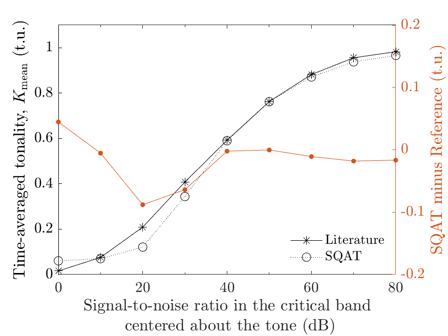

# Tonality model from Aures: verification of the implementation in SQAT
The `validation_signal_to_noise_ratio.m` code is used to verify the implementation of the tonality model from Aures [1] (see `Tonality_Aures1985` code [here](../../psychoacoustic_metrics/Tonality_Aures1985/Tonality_Aures1985.m)). The verification is performed considering pure tones (center frequency $f_{\mathrm{c}}=1000~\mathrm{Hz}$ and sound pressure level $L_{\mathrm{p}}=85~\mathrm{dB}~\mathrm{SPL}$) with different signal-to-noise ratios (SNRs) from narrowband noises (one-critical-band wide).

# How to use this code
In order to run this code and reproduce the figures available in the `figs` folder, the user needs to download the dataset of sound files from zenodo <a href="https://doi.org/10.5281/zenodo.7933206" target="_blank">here</a>. The obtained folder called `validation_SQAT_v1_0` has to be included in the `sound_files` folder of the toolbox. 

# Results
The figures below compare the results obtained using the `Tonality_Aures1985` implementation in SQAT with reference data from [2]. 
  
       

# References
[1] Aures, W. (1985). Berechnungsverfahren für den sensorischen Wohlklang beliebiger Schallsignale (A model for calculating the sensory euphony of various sounds). [Acta Acustica united with Acustica](https://www.ingentaconnect.com/content/dav/aaua/1985/00000059/00000002/art00008), 59(2), 130-141.

[2] Hastings, A., Lee, K. H., Davies, P., & Surprenant, A. M. (2003). Measurement of the attributes of complex tonal components commonly found in product sound. [Noise Control Engineering Journal](https://doi.org/10.3397/1.2839715), 51(4), 195-209.  

# Log
This code was released in SQAT v1.0, 14.05.2023

