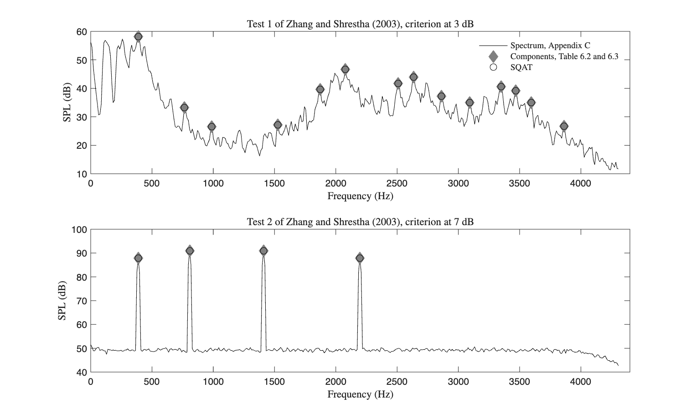
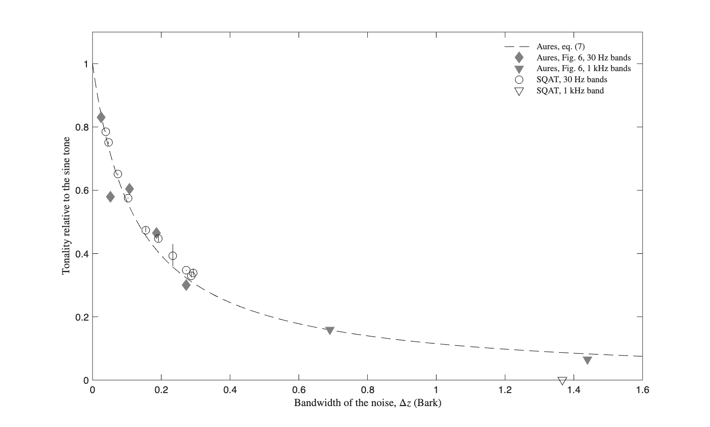

# Tonality model from Aures: verification of the implementation in SQAT
The `validation_signal_to_noise_ratio.m` code is used to verify the implementation of the tonality model from Aures [1] (see `Tonality_Aures1985` code [here](../../psychoacoustic_metrics/Tonality_Aures1985/Tonality_Aures1985.m)). The verification is performed considering the foloowing test signals:

- Pure tone (center frequency $f_{\mathrm{c}}=1~\mathrm{kHz}$ and sound pressure level $L_{\mathrm{p}}=85~\mathrm{dB}~\mathrm{SPL}$) in broadband noise, as a function of the signal-to-noise ratio inside the critical band centered about the tone, following Fig. 1(a) of [2].

Five scripts are provided. The first compares the metric with published data, the other four were added in September 2026: one states the internal consistency of the implementation against properties that follow from the definition of the model, one compares the extraction of components and the level excess with the intermediate values of an independent implementation, one compares the weighting of bandwidth with the data of Aures it was fitted to, and one compares the dependence of tonality on bandwidth with the subjective data of Hastings. None of them needs an external dataset: three generate the signals they use, and the fourth reads two published spectra kept in `reference_values`.

| script | reference | what it constrains |
| --- | --- | --- |
| [`validation_signal_to_noise_ratio.m`](validation_signal_to_noise_ratio.m) | Hastings *et al.* [2], Fig. 1(a) | the behaviour of the metric as a tone emerges from noise |
| [`validation_internal_consistency.m`](validation_internal_consistency.m) | derived in the script itself | the definitional anchor of 1 t.u., determinism, the sum over the tonal components of eq. (11), and the independence from the position of a tone in the analysis grid |
| [`validation_extraction_and_level_excess.m`](validation_extraction_and_level_excess.m) | Zhang and Shrestha [5], Appendix C and Tables 6.2 and 6.3 | the extraction of components and the level excess of Terhardt [4], code against an independent implementation |
| [`validation_bandwidth_weighting.m`](validation_bandwidth_weighting.m) | Aures [1], Fig. 6 and eq. (7) | the weighting w1, on ideal bands of noise of known bandwidth in Bark |
| [`validation_bandwidth_dependence.m`](validation_bandwidth_dependence.m) | Hastings [3], Table B.52 of the thesis | the fall of the tonality as a trapezoidal band of noise widens, against subjective scores |

# How to use this code
No external dataset is needed: four scripts generate the signals they use, and `validation_extraction_and_level_excess.m` reads the two spectra of [5] from `reference_values`.

# Results

## Behaviour as a tone emerges from noise

`validation_signal_to_noise_ratio.m` compares the implementation with Fig. 1(a) of [2], for a pure tone of 85 dB SPL at 1 kHz in broadband noise. The root mean square deviation over the nine points is 0.0129 t.u. and the largest single deviation is 0.0216 t.u. The reference curve is the output of the implementation of [2], so this comparison is code against code.

## The data set of SQAT v1.x

The nine files `1Bark_tone_prominence_XXdB_fc_1khz_44khz_64bit.wav` of the data set of SQAT v1.x (Zenodo, [doi:10.5281/zenodo.7933206](https://doi.org/10.5281/zenodo.7933206)) stay as published so that the v1.x record remains reproducible, and the script above no longer reads them. Measured on the files: 5 s at 44.1 kHz, one tone of 82.0 dB SPL at 1 kHz, and noise one Bark wide centred on the tone, whose level inside the critical band is 111 dB minus the label of the file, in steps of 10 dB. The signal to noise ratio inside the critical band, which is the abscissa of Fig. 1(a) of [2], is therefore the label minus 29 to 31 dB, and below the label of 30 dB the tone sits under the noise, so the total level of the file equals the level of the noise. Two further differences with [2]: the reference describes tones in broadband noise, and the files hold noise one critical band wide, which weighs differently in the loudness term of the model; and the comparison published with v1.x plotted the label on the axis where [2] has the signal to noise ratio.

## The extraction of components and the level excess, against an independent implementation

`validation_extraction_and_level_excess.m` injects the two power spectra that Zhang and Shrestha [5] print in their Appendix C, 401 samples 10.77 Hz apart, into the extraction stage and the level excess stage of the metric, through the local functions that `Tonality_Aures1985('localfunctions')` hands out, and compares the result with their Tables 6.2 and 6.3. Reference [5] implements the extraction and masking stages of Terhardt [4] from the papers, at IMM/DTU with Bruel and Kjaer, independently of the lineage this code descends from, so it is the only source at hand that can tell an error of this implementation from one shared with its ancestors. Test 1 uses 3 dB in the criterion, which is what [5] used for its tables (p. 49 of the thesis); Test 2 uses the 7 dB of [4].

Three results. The extraction finds the fourteen components of Table 6.2 and the four of Table 6.3, each within one sample in frequency and with the same level to 0.01 dB. The excitation and threshold terms of the level excess reproduce the values of [5] within 0.20 dB on the components masked by the other components, with the noise term left out. The noise term of the metric equals the sum that eq. (4) of [4] defines, the intensities of the samples within half a Bark on each side of the component with the five central samples of every component skipped, to 0.000 dB on the four components of Test 2 with a positive excess; the edges of that band were rounded to whole Bark before September 2026, which moved the band by up to half a Bark.

The level excess of [5] cannot verify the noise term. With that term replaced by one constant of 18.5 dB the formula reproduces all twelve published values within 1.6 dB, while the sum the definition asks for reads 31 to 62 dB on those spectra. The noise term of [5] does not follow its own eq. (4), so its level excesses hold no information about that term, and the script reports this rather than asserting on it.

## The weighting of bandwidth, against the data it was fitted to

`validation_bandwidth_weighting.m` compares the implementation with Fig. 6 of [1], the relative tonality of bandpass noise against its bandwidth in Bark, normalised by a sine tone of the same frequency, which is the data the weighting w1 of eq. (7) was fitted to. The test signals follow [1]: ideal bandpass noise 30 Hz wide at ten centre frequencies from 150 Hz to 4.5 kHz, which covers bandwidths from 0.04 to 0.29 Bark, and a band 1 kHz wide at 4.2 kHz, 1.37 Bark, all at 14 sone, with three noise realisations each. The reference curve is eq. (7) itself; the points of Fig. 6 are shown as read off the figure.

Over the ten bands of 30 Hz the model falls with the bandwidth and stays within 0.042 of eq. (7), with a root mean square distance of 0.025, so the weighting acts on the bandwidth the signal has. For the band 1 kHz wide the model reads zero where eq. (7) gives 0.087 and Fig. 6 reads 0.065 at 1.44 Bark: the extraction step of [1] counts a component wider than a critical band as noise, so the model as published cannot keep the small tonality the measurement shows beyond one Bark. The second point of [1] for 1 kHz bands, at 0.69 Bark, needs a centre frequency near 6.5 kHz, above the upper limit of the implementation, so it has no counterpart here.

## Dependence on the bandwidth of the component

`validation_bandwidth_dependence.m` compares the implementation with Table B.52 of [3], third tone test, 17 subjects, direct scaling. The test signals are trapezoidal bandpass noise centred at 700 Hz with a roll-off of 100 dB per octave and a peak bandwidth from 1 to 200 per cent of the critical bandwidth, equalised to 16 sone as in the experiment. The table carries its own anchors, a pure tone at 8.0 and broadband noise at 2.0, which [3] scales to 1 and 0 on p. 69, so the reference plotted here is (score - 2)/6.

**This comparison fails, and it is kept because of what it records.** The reference falls from 0.58 to 0.38 of the tonality of a pure tone across the sweep. The implementation reads between 0.07 and 0.11 up to half a critical bandwidth and falls to zero from three quarters on, where the component it finds is as wide as a critical band and the model counts it as noise. The gap between the mean of the reference and the mean of the model is 0.47. It was 0.49 before the extraction of narrow band components was implemented in September 2026, when the implementation stayed between 0.004 and 0.042 without order.

The reason is a limit of the model, and these stimuli make it visible. With a roll-off of 100 dB per octave the skirts carry most of the power of the band: the stimulus with a peak bandwidth of 1 per cent of the critical bandwidth, 1.3 Hz, holds the middle 90 per cent of its power over 86 Hz, which is 0.66 Bark, and the stimulus with a peak bandwidth of 25 per cent holds it over 93 Hz, 0.71 Bark. The implementation extracts each of them as one component of that width, following the second extraction step of Aures [1], and the weighting w1 of eq. (7) gives both about 0.16. Listeners respond to the sharp tip and score the narrowest stimulus at 0.58 of a pure tone. The weighting of Aures accounts for the bandwidth of a component and has no term for the rate at which its skirt falls. In the same table of [3], with the bandwidth held at 1 per cent of the critical bandwidth, the score runs from 0.05 to 0.87 of the scale as the roll-off goes from 20 to 250 dB per octave, while with the roll-off held at 100 dB per octave the whole bandwidth sweep covers 0.58 to 0.38. Reference [3] states this and proposes a modified weighting that carries a roll-off term. This figure is not expected to close with the model as published.

The roll-off term is tracked in issue [#67](https://github.com/ggrecow/SQAT/issues/67).

# References
[1] Aures, W. (1985). Berechnungsverfahren für den sensorischen Wohlklang beliebiger Schallsignale (A model for calculating the sensory euphony of various sounds). [Acta Acustica united with Acustica](https://www.ingentaconnect.com/content/dav/aaua/1985/00000059/00000002/art00008), 59(2), 130-141.

[2] Hastings, A., Lee, K. H., Davies, P., & Surprenant, A. M. (2003). Measurement of the attributes of complex tonal components commonly found in product sound. [Noise Control Engineering Journal](https://doi.org/10.3397/1.2839715), 51(4), 195-209.  

[3] Hastings, A. L. (2004). Sound quality of diesel engines. PhD thesis, Purdue University, ProQuest 3154642. The tables of Appendix B carry the subjective scores of the experiments reported in [2].

[4] Terhardt, E., Stoll, G., & Seewann, M. (1982). Algorithm for extraction of pitch and pitch salience from complex tonal signals. [The Journal of the Acoustical Society of America](https://doi.org/10.1121/1.387544), 71(3), 679-688.

[5] Zhang, Z., & Shrestha, M. (2003). Sound Quality User-defined Cursor Reading Control, Tonality Metric. Master thesis, IMM-Thesis-2003-22, Technical University of Denmark, with Bruel and Kjaer. [PDF at the IMM publication database](http://www2.imm.dtu.dk/pubdb/edoc/imm2385.pdf).

# Log

- Gil Felix Greco, 14.05.2023: `validation_signal_to_noise_ratio.m` code released in SQAT v1.0,  

- Sergio Aguirre, September 2026: `validation_internal_consistency.m` and `validation_bandwidth_dependence.m` added after corrections on the main code (see the log of `Tonality_Aures1985.m`). Unlike previous versions, test signals for `validation_signal_to_noise_ratio.m` are now generated locally by the script. The zenodo dataset (https://doi.org/10.5281/zenodo.7933206) has deliberately not been updated so that the SQAT v1.x record remains reproducible as published.

- Sergio Aguirre, September 2026: both figures regenerated and the text of the bandwidth comparison rewritten after `Tonality_Aures1985.m` gained the extraction of narrow band components and the corrected noise term of the level excess.

- Sergio Aguirre, September 2026: `validation_bandwidth_weighting.m` added, against Fig. 6 and eq. (7) of Aures.

- Sergio Aguirre, September 2026: section on the data set of SQAT v1.x added, with what the files contain and how their labels map to the abscissa of Fig. 1(a) of [2].

- Sergio Aguirre, September 2026: `validation_extraction_and_level_excess.m` added, against the spectra and tables of Zhang and Shrestha [5], with the two spectra kept in `reference_values`.  