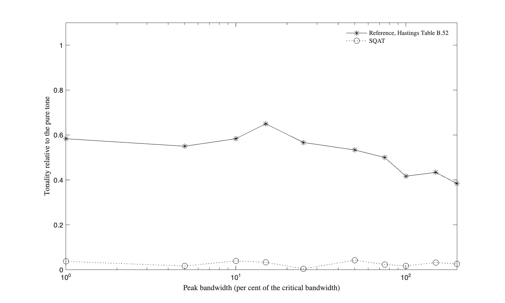

# Tonality model from Aures: verification of the implementation in SQAT
The `validation_signal_to_noise_ratio.m` code is used to verify the implementation of the tonality model from Aures [1] (see `Tonality_Aures1985` code [here](../../psychoacoustic_metrics/Tonality_Aures1985/Tonality_Aures1985.m)). The verification is performed considering the foloowing test signals:

- Pure tone (center frequency $f_{\mathrm{c}}=1~\mathrm{kHz}$ and sound pressure level $L_{\mathrm{p}}=85~\mathrm{dB}~\mathrm{SPL}$) in broadband noise, as a function of the signal-to-noise ratio inside the critical band centered about the tone, following Fig. 1(a) of [2].

Three scripts are provided. The first compares the metric with published data, the other two were added in September 2026: one states the internal consistency of the implementation against properties that follow from the definition of the model, and the other compares the dependence of tonality on bandwidth with the subjective data of Hastings. The last two generate the signals they use and need no external dataset.

| script | reference | what it constrains |
| --- | --- | --- |
| [`validation_signal_to_noise_ratio.m`](validation_signal_to_noise_ratio.m) | Hastings *et al.* [2], Fig. 1(a) | the behaviour of the metric as a tone emerges from noise |
| [`validation_internal_consistency.m`](validation_internal_consistency.m) | derived in the script itself | the definitional anchor of 1 t.u., determinism, the sum over the tonal components of eq. (11), and the independence from the position of a tone in the analysis grid |
| [`validation_bandwidth_dependence.m`](validation_bandwidth_dependence.m) | Hastings [3], Table B.52 of the thesis | the fall of the tonality as a narrow band of noise widens, Aures [1] Fig. 6 |

# How to use this code
The three scripts generate the signals they use, so no external dataset is needed.

# Results

## Behaviour as a tone emerges from noise

`validation_signal_to_noise_ratio.m` compares the implementation with Fig. 1(a) of [2], for a pure tone of 85 dB SPL at 1 kHz in broadband noise. The root mean square deviation over the nine points is 0.0249 t.u. and the largest single deviation is 0.0526 t.u., at a signal to noise ratio of 0 dB.

## Dependence on the bandwidth of the component

`validation_bandwidth_dependence.m` compares the implementation with Table B.52 of [3], third tone test, 17 subjects, direct scaling. The test signals are trapezoidal bandpass noise centred at 700 Hz with a roll-off of 100 dB per octave and a peak bandwidth from 1 to 200 per cent of the critical bandwidth, equalised to 16 sone as in the experiment. The table carries its own anchors, a pure tone at 8.0 and broadband noise at 2.0, which [3] scales to 1 and 0 on p. 69, so the reference plotted here is (score - 2)/6.

**This comparison fails, and it is kept because of what it records.** The reference falls from 0.58 to 0.38 of the tonality of a pure tone across the sweep, and the implementation stays between 0.02 and 0.13 without order. A band of 1.3 Hz, which is perceptually a tone, scores about a tenth of what a pure tone scores.

Two reasons, and they are of different kinds.

The first is an omission of this implementation. Aures [1] describes a second extraction step, in the paragraph after Fig. 8: once the sinusoidal components have been removed, the residue is searched for regions narrower than a critical band whose level exceeds each neighbouring critical band by at least 7 dB, and those regions are counted among the tonal components. That step is not implemented here. What is implemented is the peak criterion of Terhardt [4], which asks for 7 dB above the bins two and three away. At 700 Hz with the present analysis window that distance is 0.038 octave, where a skirt of 100 dB per octave falls 3.8 dB, so the criterion does not fire and a narrow band of noise is never promoted to a tonal component.

The second is a limit of the model. The weighting of Aures accounts for the bandwidth of a component and has no term for the rate at which its skirt falls. In the same table of [3], with the bandwidth held at 1 per cent of the critical bandwidth, the score runs from 0.05 to 0.87 of the scale as the roll-off goes from 20 to 250 dB per octave, while with the roll-off held at 100 dB per octave the whole bandwidth sweep covers 0.58 to 0.38. Reference [3] states this and proposes a modified weighting that carries a roll-off term. So this figure is expected to improve when the missing extraction step is implemented, and it is not expected to close.

The work on both points is tracked in issue [#67](https://github.com/ggrecow/SQAT/issues/67).

# References
[1] Aures, W. (1985). Berechnungsverfahren für den sensorischen Wohlklang beliebiger Schallsignale (A model for calculating the sensory euphony of various sounds). [Acta Acustica united with Acustica](https://www.ingentaconnect.com/content/dav/aaua/1985/00000059/00000002/art00008), 59(2), 130-141.

[2] Hastings, A., Lee, K. H., Davies, P., & Surprenant, A. M. (2003). Measurement of the attributes of complex tonal components commonly found in product sound. [Noise Control Engineering Journal](https://doi.org/10.3397/1.2839715), 51(4), 195-209.  

[3] Hastings, A. L. (2004). Sound quality of diesel engines. PhD thesis, Purdue University, ProQuest 3154642. The tables of Appendix B carry the subjective scores of the experiments reported in [2].

[4] Terhardt, E., Stoll, G., & Seewann, M. (1982). Algorithm for extraction of pitch and pitch salience from complex tonal signals. [The Journal of the Acoustical Society of America](https://doi.org/10.1121/1.387544), 71(3), 679-688.

# Log

- Gil Felix Greco, 14.05.2023: `validation_signal_to_noise_ratio.m` code released in SQAT v1.0,  

- Sergio Aguirre, September 2026: `validation_internal_consistency.m` and `validation_bandwidth_dependence.m` added after corrections on the main code (see the log of `Tonality_Aures1985.m`). Unlike previous versions, test signals for `validation_signal_to_noise_ratio.m` are now generated locally by the script. The zenodo dataset (https://doi.org/10.5281/zenodo.7933206) has deliberately not been updated so that the SQAT v1.x record remains reproducible as published.  