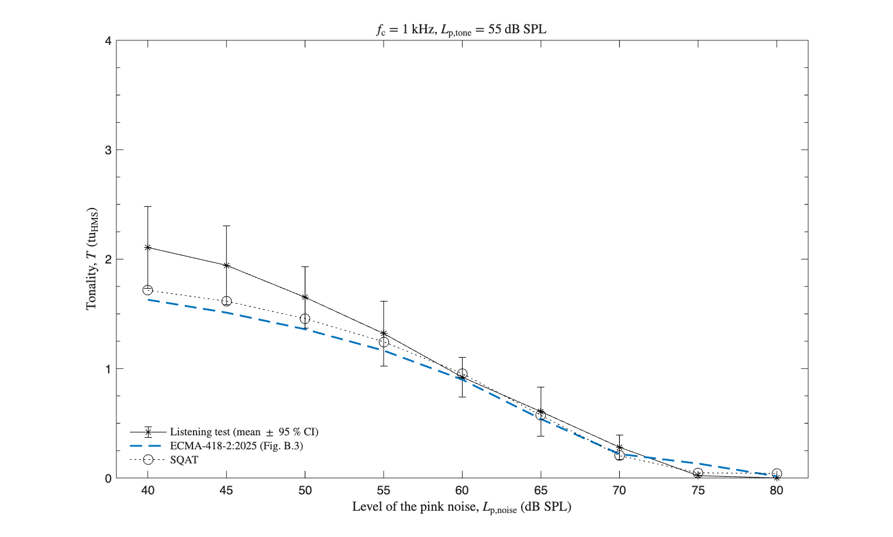
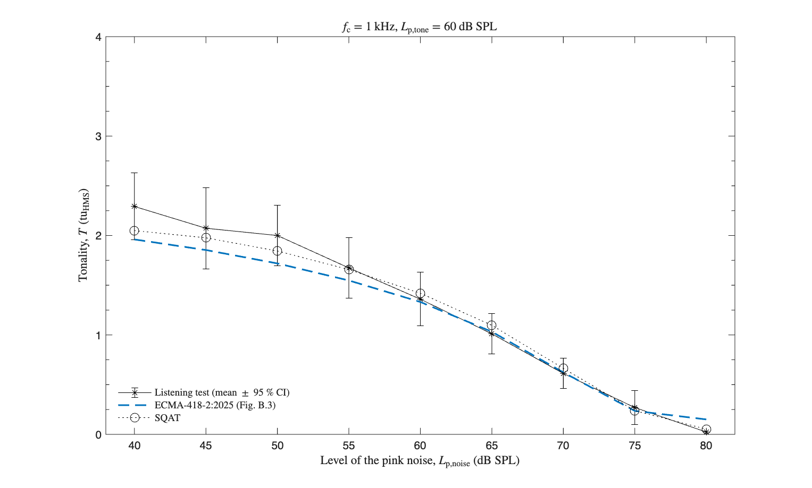
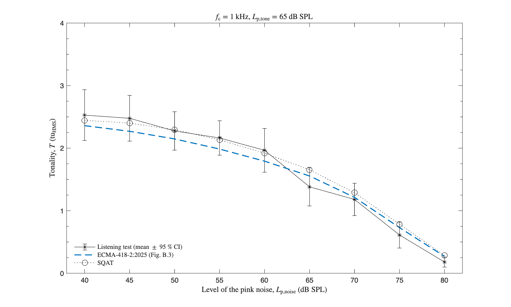
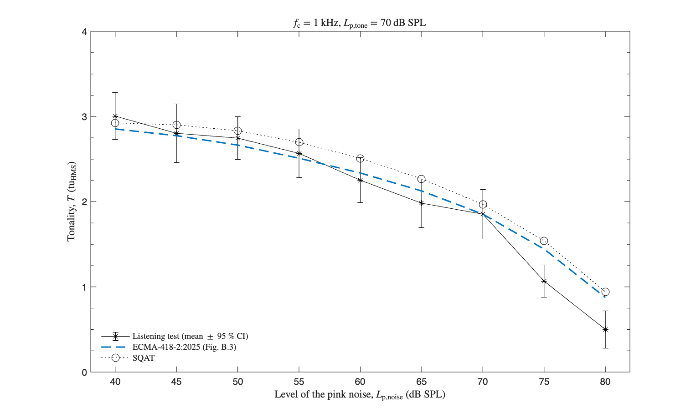
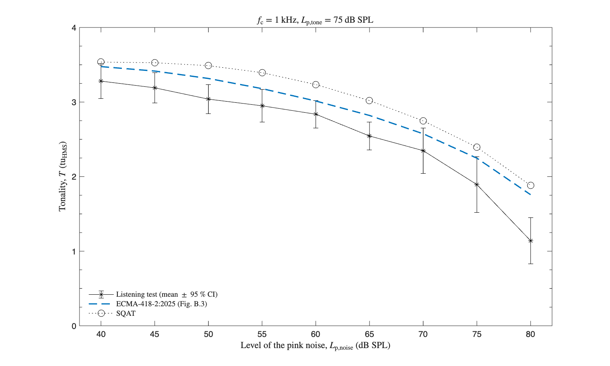

# About this code 
The `run_validation_tonality_tone_in_noise.m` code is used to verify the implementation of the tonality model according to ECMA-418-2:2025 [1] (see `Tonality_ECMA418_2` code [here](../../../psychoacoustic_metrics/Tonality_ECMA418_2/Tonality_ECMA418_2.m)). The verification reproduces Figure B.3 of the standard, which reports the evaluation of the psychoacoustic tonality described in Annex B.2. The following test signals are used:

- Mixtures of a sinusoidal tone with frequency $f_{\mathrm{c}}=1~\mathrm{kHz}$ and sound pressure level $L_{\mathrm{p,tone}}=[55, 60, 65, 70, 75]~\mathrm{dB}~\mathrm{SPL}$ with pink noise at $L_{\mathrm{p,noise}}=40~\mathrm{dB}~\mathrm{SPL}$ to $80~\mathrm{dB}~\mathrm{SPL}$ in steps of $5~\mathrm{dB}$, which gives the five experiments of Annex B.2 with nine signal-to-noise ratios each.

The reference values were digitised from Figure B.3 and are stored in `reference_values/ECMA418_2_FigB3.mat`. They comprise the model results curve of the figure and the listening test results, given as mean ratings with their 95% confidence intervals. Annex B.2 describes the listening tests: 16 test subjects rated the tonality of each sound on a 13-point categorical scale, and the mean ratings were mapped to tonality units through a linear scaling factor derived by minimising the root-mean-square error over the five experiments. The reading resolution of the digitisation is about $0.05~\mathrm{tu}_{\mathrm{HMS}}$, and the three listening test points that coincide with the abscissa of the figure were read as zero with a zero-width interval.

The prominence ratio curve of Figure B.3 is left out of the reproduction, because the prominence ratio is specified in ECMA-418-1 and lies outside the scope of the present implementation. Annex B.2 reports error measures of 0,21 for the psychoacoustic tonality, 0,70 for the prominence ratio and 0,74 for the tone-to-noise ratio, all related to the 13-point categorical scale.

# How to use this code
The 45 signals are generated within the code, so no sound file has to be downloaded. Annex B.2 specifies the frequency of the tone and the two level ranges, and leaves the remaining properties of the stimuli open. The choices made here are stated in the header of the code: $2~\mathrm{s}$ duration, $48~\mathrm{kHz}$ sampling frequency, pink noise band-limited between $20~\mathrm{Hz}$ and $20~\mathrm{kHz}$, one single noise realisation (fixed random seed) shared by the 45 mixtures, and signals gated on and off without a ramp.

Over the whole grid of 45 signals, these choices move the tonality by up to $0.095~\mathrm{tu}_{\mathrm{HMS}}$ (pink noise limited to $50~\mathrm{Hz}$ to $10~\mathrm{kHz}$), $0.050~\mathrm{tu}_{\mathrm{HMS}}$ (diffuse field stage in place of the free-frontal one), $0.042~\mathrm{tu}_{\mathrm{HMS}}$ ($4~\mathrm{s}$ duration), $0.033~\mathrm{tu}_{\mathrm{HMS}}$ (other noise realisations) and $0.019~\mathrm{tu}_{\mathrm{HMS}}$ ($50~\mathrm{ms}$ raised-cosine ramps). Repeating the whole comparison under each of those five alternatives keeps the rms deviation from the model results curve between $0.113$ and $0.128~\mathrm{tu}_{\mathrm{HMS}}$ and the number of values inside the listening test confidence intervals between 27 and 30 of 45, so the figures reported below do not hinge on the choices.

Results computed using SQAT correspond to the time-averaged overall tonality, which ECMA-418-2:2025 (Section 6.2.11) defines as the representative single value to express the overall tonality.

# Results
The figures below compare the results obtained using the `Tonality_ECMA418_2.m` implementation in SQAT with the model results curve of Figure B.3 and with the listening test results of Annex B.2.

|  |  |
| -------------- | -------------- |

|  |  |
| -------------- | -------------- |

The deviation between the results computed using SQAT and the model results curve of Figure B.3 is given below. SQAT reads higher than the curve at 42 of the 45 points, by an amount that grows with the level of the tone. The three remaining points are $L_{\mathrm{p,tone}}=55~\mathrm{dB}~\mathrm{SPL}$ with $L_{\mathrm{p,noise}}=70$ and $75~\mathrm{dB}~\mathrm{SPL}$, and $L_{\mathrm{p,tone}}=60~\mathrm{dB}~\mathrm{SPL}$ with $L_{\mathrm{p,noise}}=80~\mathrm{dB}~\mathrm{SPL}$, where SQAT reads lower by 0.015, 0.085 and 0.098 $\mathrm{tu}_{\mathrm{HMS}}$. Those three points sit on the part of the curve that runs along the abscissa of Figure B.3, where the digitisation is least certain.

| $L_{\mathrm{p,tone}}$ (dB SPL) | rms deviation (tuHMS) | max absolute deviation (tuHMS) |
| -------------- | -------------- | -------------- |
| 55 | 0.072 | 0.104 |
| 60 | 0.091 | 0.125 |
| 65 | 0.107 | 0.148 |
| 70 | 0.134 | 0.188 |
| 75 | 0.166 | 0.221 |
| all | 0.118 | 0.221 |

Against the listening test results, 29 of the 45 values computed using SQAT lie inside the 95% confidence interval, against 31 of 45 for the model results curve of the standard. The error measure defined in Annex B.2, which takes the distance to the closest bound of the confidence interval and is zero for a value lying inside it, is $0.116~\mathrm{tu}_{\mathrm{HMS}}$ for SQAT and $0.069~\mathrm{tu}_{\mathrm{HMS}}$ for the model results curve. The measure is expressed here in tonality units, because the scaling factor between the 13-point categorical scale and the tonality units is not reported in the standard. Leaving out the three points read with a zero-width interval keeps both counts unchanged, at 29 and 31 out of 42, and moves the error measures to $0.120$ and $0.066~\mathrm{tu}_{\mathrm{HMS}}$.

# References
[1] Ecma International. (2025). Psychoacoustic metrics for ITT equipment - Part 2 (methods for describing human perception based on the Sottek Hearing Model) (Standard No. 418-2, 4th Edition/June 2025). [(link)](https://ecma-international.org/wp-content/uploads/ECMA-418-2_4th_edition_june_2025.pdf) (last viewed September 18, 2026)

# Log
Created by Sergio Aguirre and Gil Felix Greco (18.09.2026)
