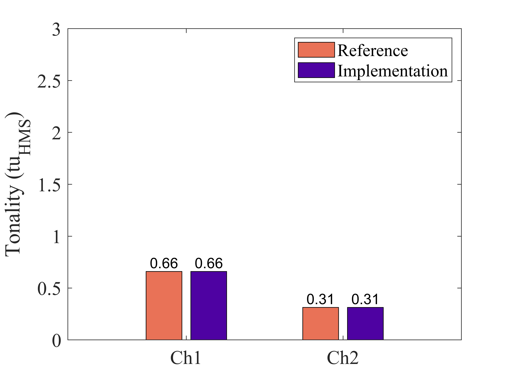

# About this code 

The `Tonality_ECMA418_2_software_comparison.m` code compares tonality results (ECMA-418-2 model [1]) obtained using a commercial software (ref. results) and using the implementation in SQAT (see `Tonality_ECMA418_2.m` code [here](../../../psychoacoustic_metrics/Tonality_ECMA418_2/Tonality_ECMA418_2.m)). To perform this study, a binaural file recorded in a 'train station' environment is used. The signal 'TrainStation.7.wav' was extracted from the EigenScape database [(link)](https://zenodo.org/doi/10.5281/zenodo.1012808), and trimmed between 01m00s and 01m30s. The EigenScape database, which is described by 
Green et al. [2], is licenced under Creative Commons Attribution 4.0.   
 

<!-- Artemis Suite 15.7-->

# How to use this code
The following sound file is required: `ExStereo_TrainStation7-0100-0130.wav`, which is stored in the `sound_files\reference_signals` folder. 

# Results

## Time-dependent tonality

| Channel 1       | Channel 2          |
| -------------- | -------------- |
|    |     |

 

## Time-averaged specific tonality

Channel 1  |  
:-------------------------:| 
|  | 

Channel 2 |  
:-------------------------:| 
|  | 

 
## Time-dependent specific tonality

| Reference (channel 1)       | Implementation (channel 1)          |
| -------------- | -------------- |
|   |    |

|   Reference (channel 2)       | Implementation (channel 2)          |
| -------------- | -------------- |
|   |   |

## Overall tonality

# References
[1] Ecma International. (2024). Psychoacoustic metrics for ITT equipment - Part 2 (methods for describing human perception based on the Sottek Hearing Model) (Standard No. 418-2, 3rd Edition/December 2024). [https://ecma-international.org/wp-content/uploads/ECMA-418-2_3rd_edition_december_2024.pdf](https://ecma-international.org/wp-content/uploads/ECMA-418-2_3rd_edition_december_2024.pdf) (Last viewed 22 Jan 2025)

[2] Green, M. C., & Murphy, D. (2017). EigenScape: A Database of Spatial Acoustic Scene Recordings. [Applied sciences](https://doi.org/10.3390/app7111204), 7(11), 1004.  

# Log
Last checked: Gil Felix Greco (12.02.2025)

