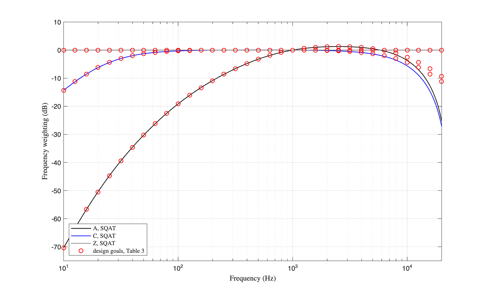
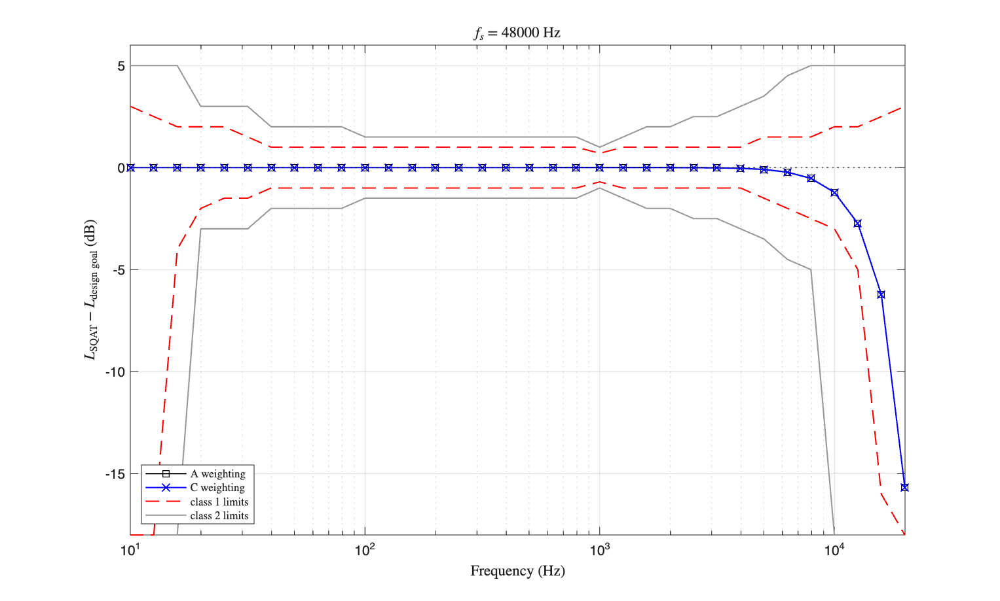
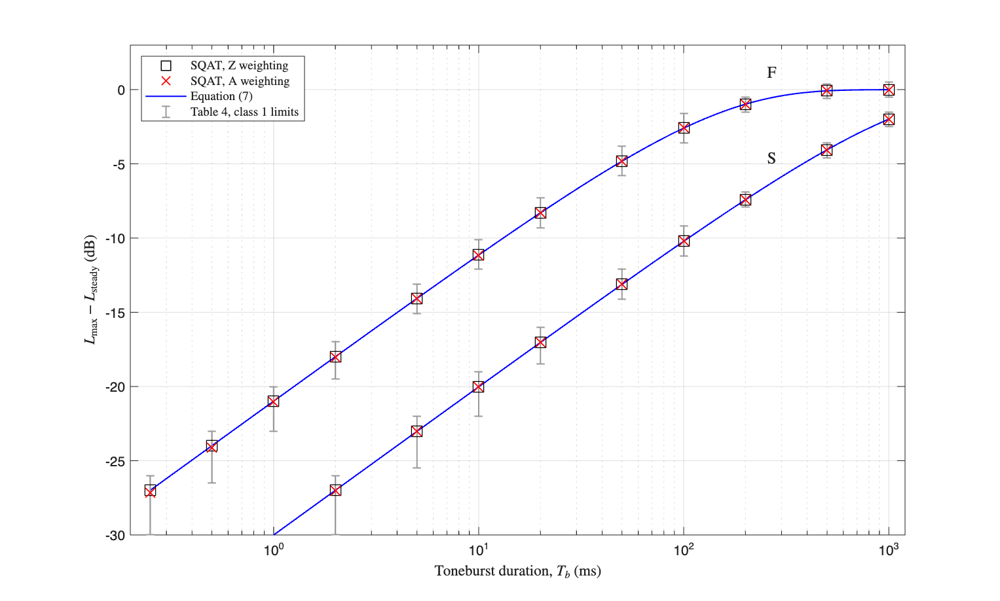
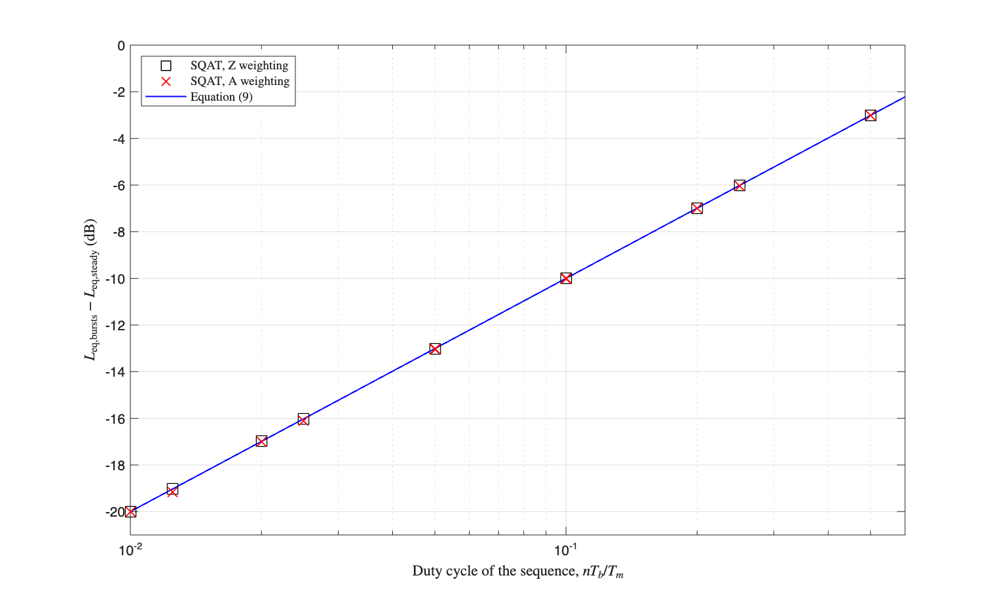

# Sound level meter: verification against IEC 61672-1

This folder verifies the sound level meter of SQAT against IEC 61672-1 [1]: the exponential time weighting and the calibration applied by [`Do_SLM`](../../sound_level_meter/Do_SLM.m), the frequency weighting filters it uses, [`Gen_weighting_filters`](../../sound_level_meter/Gen_weighting_filters.m), and the equivalent continuous level obtained from the time weighted level through [`Get_Leq`](../../sound_level_meter/Get_Leq.m).

Four scripts are provided. Three of them use reference values tabulated in the standard, so their outcome is a statement of conformance with the acceptance limits of performance classes 1 and 2. The fourth uses a reference derived from the definition of exponential time weighting, so its outcome is a statement of internal consistency, and it is the check that isolates the fault reported in issue [#43](https://github.com/ggrecow/SQAT/issues/43). Every script generates the signals it uses, needs no external dataset, and prints a PASS or FAIL verdict.

| script | clause of IEC 61672-1 | reference | what it constrains |
| --- | --- | --- | --- |
| [`validation_Do_SLM_frequency_weightings.m`](validation_Do_SLM_frequency_weightings.m) | 5.5, Table 3, Annex E | tabulated in the standard | pole frequencies and normalization of the A, C and Z filters |
| [`validation_Do_SLM_toneburst_response.m`](validation_Do_SLM_toneburst_response.m) | 5.9, Table 4, Equation (7) | tabulated in the standard | exponential time constants, 0.125 s for F and 1 s for S |
| [`validation_Do_SLM_repeated_tonebursts.m`](validation_Do_SLM_repeated_tonebursts.m) | 5.10, Equation (9) | tabulated in the standard | energy averaging and calibration under impulsive signals |
| [`validation_Do_SLM_time_weighting.m`](validation_Do_SLM_time_weighting.m) | 3.4, 3.6, Equation (1) | derived in the script itself | squaring before the smoothing, and the calibration of the result |

# 1. Frequency weightings, Table 3 and Annex E

Table 3 of the standard gives the design goal of the A, C and Z frequency weightings at 34 nominal frequencies from 10 Hz to 20 kHz, rounded to a tenth of a decibel, together with the acceptance limits for performance classes 1 and 2. Annex E (normative) gives the analytical expressions the table was computed from. The script transcribes Table 3, recomputes the design goals from the expressions of Annex E, and checks that the transcription is the analytical value rounded to a tenth of a decibel. Deviations are then taken against the unrounded analytical values, at the exact frequencies `f = 1000*10^((n-30)/10)` Hz with `n = 10 ... 43` stated in the note to Table 3.

| Frequency weightings of SQAT and the design goals of Table 3 | Deviation from the design goals against the acceptance limits |
| -------------- | -------------- |
|  |  |

The A and C filters of SQAT reproduce the design goals within 0.05 dB from 10 Hz to 4 kHz, and the Z weighting is exactly flat because `Gen_weighting_filters` returns unit coefficients for it. Above 4 kHz the response falls away from the design goal, because `Gen_weighting_filters` discretizes the analogue filter with the bilinear transform, which compresses the frequency axis as the Nyquist frequency is approached. The deviation depends on the sampling frequency:

| sampling frequency | 10 kHz | 12.5 kHz | 16 kHz | 20 kHz |
| --- | --- | --- | --- | --- |
| 44 100 Hz | -1.50 dB | -3.45 dB | -8.21 dB | -24.17 dB |
| 48 000 Hz | -1.21 dB | -2.73 dB | -6.21 dB | -15.66 dB |
| 96 000 Hz | -0.26 dB | -0.54 dB | -1.08 dB | -2.08 dB |
| class 1 acceptance limits | +2.0; -3.0 dB | +2.0; -5.0 dB | +2.5; -16.0 dB | +3.0 dB; no lower limit |

Every value stays inside the acceptance limits of class 1, and therefore of class 2 as well, at 44 100 Hz and at 48 000 Hz, which are the two sampling frequencies the script tests. The third row is reported here so that the origin of the roll-off is visible: it is a property of the sampling frequency and it shrinks as the sampling frequency grows. Users working with content above 10 kHz, and with the A weighting in particular, should keep this in mind, since the same filters are used by every A weighted or C weighted quantity in the toolbox.

# 2. Toneburst response, Table 4 and Equation (7)

Clause 5.9 defines the toneburst response as the difference between the maximum time weighted sound level of a single 4 kHz toneburst of duration `Tb`, extracted from a steady 4 kHz sinusoid, and the sound level of that steady sinusoid. The reference response is

```
delta_ref = 10*log10( 1 - exp(-Tb/tau) )  dB
```

which is Equation (7), with `tau` the exponential time constant of clause 5.8.1, 0.125 s for time weighting F and 1 s for time weighting S. Table 4 lists this value for twelve durations from 0.25 ms to 1 s under F and for nine durations from 2 ms to 1 s under S, with the acceptance limits of both performance classes. NOTE 3 of Table 4 states that the reference responses hold for the A, C and Z frequency weightings, so the three of them are tested.

| 4 kHz toneburst response |
| -------------- |
|  |

This is the check that constrains the time constants. The response of a short toneburst falls as `10*log10(Tb/tau)`, so a time constant in error by a factor k moves every short burst by `10*log10(k)` dB, and the acceptance limits of the longest bursts are as tight as 0.5 dB. With the current implementation, the largest deviation from Table 4 over the three frequency weightings and both time weightings is 0.14 dB, and the largest deviation from Equation (7) is 0.15 dB. Both occur at the shortest burst under the A weighting, where the spectrum of the burst is wide compared with the A curve and the weighting filter redistributes part of the energy of the burst in time. Under the Z weighting the agreement with Equation (7) is within 0.001 dB.

# 3. Repeated tonebursts, Equation (9)

Clause 5.10.3 states that a sequence of `n` tonebursts of duration `Tb` extracted from a steady 4 kHz sinusoid, measured over a total duration `Tm`, has a time averaged sound level that differs from the level of the steady sinusoid by

```
delta_ref = 10*log10( n*Tb/Tm )  dB
```

which is Equation (9), and clause 5.10.1 requires the deviation from that value to stay inside the acceptance limits of Table 4 for the burst duration used. Two sequences are tested, one with a repetition period of 1 s and one of 20 ms, covering burst durations from 500 ms down to 0.25 ms and values of `n*Tb/Tm` from 0.5 down to 0.0125, which is 19 dB below the steady level.

| Time averaged level of the toneburst sequences |
| -------------- |
|  |

The largest deviation from Equation (9) is 0.13 dB, again at the shortest burst under the A weighting and from the same cause. Under the Z weighting the sequences reproduce Equation (9) within 0.001 dB. This check exercises the calibration on signals whose energy is concentrated in a small fraction of the measurement time, which is where a fixed calibration offset tuned on a sinusoid fails. Section 4 quantifies that failure for the implementation released up to v1.3.

# 4. Energy consistency of the time weighting

The reference of this check is derived in the script itself, and no value is taken from the tables of the standard. Clause 3.4 defines time weighting as an exponential weighting of the square of the sound pressure, and Figure 1 together with Equation (1) of clause 3.6 gives the chain explicitly. The smoothing low-pass has unit gain at zero frequency, so averaging its output over a stationary signal returns the mean square of the weighted pressure whatever the waveform is, and the level satisfies

```
Leq = 20*log10( rms(p_weighted)/p0 ),    p0 = 20 uPa
```

Seven signals are generated, all scaled to the same root mean square and therefore all representing the same true sound pressure level. Only their waveform differs:

| signal | crest factor | form factor |
| --- | --- | --- |
| sinusoid, 1 kHz | 1.41 | 0.8990 |
| Gaussian white noise | 4.68 | 0.7978 |
| 1 kHz tone bursts, duty cycle 0.50 | 2.00 | 0.6357 |
| 1 kHz tone bursts, duty cycle 0.25 | 2.83 | 0.4490 |
| 1 kHz tone bursts, duty cycle 0.10 | 4.47 | 0.2843 |
| 1 kHz tone bursts, duty cycle 0.05 | 6.13 | 0.2047 |
| 1 kHz tone bursts, duty cycle 0.02 | 11.17 | 0.1185 |

The form factor is the ratio between the mean absolute value of the weighted pressure and its root mean square. It is the quantity that governs this verification: an implementation that smooths the absolute value of the pressure in place of its square reports a level low by `20*log10(form factor)` decibels, so sweeping the form factor over close to one decade sweeps the deviation over roughly 18 dB.

Each signal is processed with both frequency weightings, `Z` and `A`, and with both time weightings, `fast` and `slow`. The lead-in discarded before averaging is 1.5 s under fast weighting and 5 s under slow weighting, which leaves the leaky integrator enough time to settle in both cases. The tolerance applied to every deviation is 0.05 dB.

| Deviation of the time weighted level against the form factor of the signal |
| -------------- |
|  |

The figure shows the deviation from the reference against the form factor of the weighted signal, for `Z` weighting and fast time weighting. Results obtained with the implementation released up to v1.3 are shown for comparison, together with the analytical deviation of an implementation that smooths the absolute value of the pressure. Every value produced up to v1.3 falls on that curve, which identifies the deviation as the form factor deficit and nothing else. The tone bursts with a duty cycle of 0.02 were reported 17.6 dB below their true level. Signals whose form factor is close to that of a sinusoid were reported correctly, because the calibration used up to v1.3 carried a fixed offset of 0.93 dB that cancels the deficit of a sinusoid to within 0.02 dB. With the current implementation the largest deviation across all seven signals and all four weighting combinations is 0.034 dB.

The scope of this check is limited by construction. The identity it uses holds for any time constant and for any frequency weighting, because the time constant cancels under energy averaging and the weighting filter is applied on both sides of the comparison. It therefore constrains the structure of the measurement, squaring before the smoothing and the calibration of the result, and it leaves the parameter values to the three checks above. The four combinations of frequency and time weighting it reports are, in that sense, the same test repeated four times.

# References
[1] International Electrotechnical Commission. (2013). Electroacoustics - Sound level meters - Part 1: Specifications (IEC Standard No. 61672-1).

# Log
- This verification was released in SQAT v2.0 (Sergio Aguirre, 23.08.2026)
- Verification against the reference values tabulated in IEC 61672-1, clauses 5.5, 5.9 and 5.10, was added in SQAT v2.0 (Sergio Aguirre, 28.08.2026)
