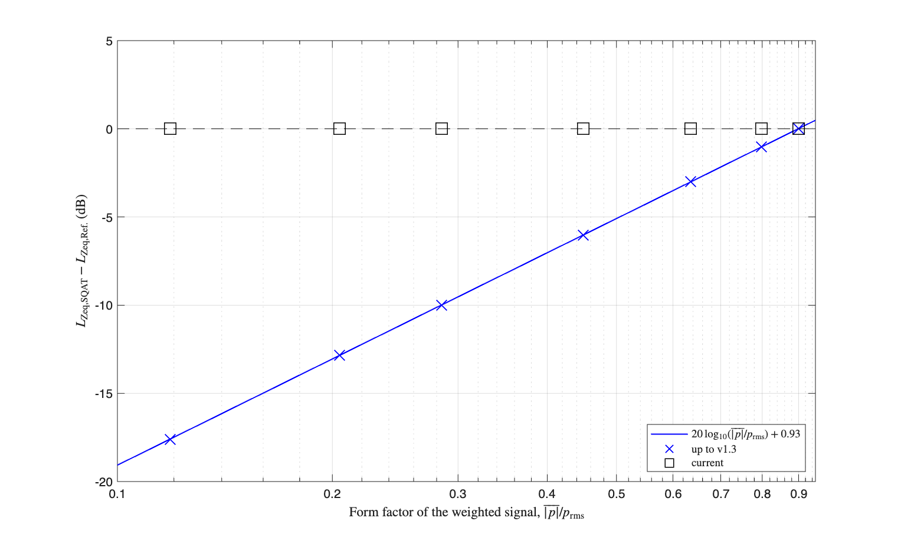

# Sound level meter: verification of the exponential time weighting

This folder verifies the exponential time weighting applied by [`Do_SLM`](../../sound_level_meter/Do_SLM.m), together with the equivalent continuous level obtained from it through [`Get_Leq`](../../sound_level_meter/Get_Leq.m).

# Reference used

IEC 61672-1 [1] defines exponential time weighting as a first order low-pass applied to the **squared** sound pressure, with the level taken as ten times the base ten logarithm of the resulting mean square. Averaging that quantity over a stationary signal returns the equivalent continuous sound level, so for any stationary input the result satisfies

```
Leq = 20*log10( rms(p_weighted) / p0 ),    p0 = 20 uPa
```

whatever the waveform is. That identity is the reference of this verification. It is exact and analytical, so this script needs no measured data and no external dataset: it generates every signal it uses and runs straight after cloning the toolbox.

# Method

Seven signals are generated, all scaled to the same root mean square and therefore all representing the same true sound pressure level. Only their waveform differs:

| signal | crest factor | form factor |
| --- | --- | --- |
| sinusoid, 1 kHz | 1.41 | 0.8990 |
| Gaussian white noise | 4.68 | 0.7978 |
| 1 kHz tone bursts, duty cycle 0.50 | 2.00 | 0.6357 |
| 1 kHz tone bursts, duty cycle 0.25 | 2.83 | 0.4490 |
| 1 kHz tone bursts, duty cycle 0.10 | 4.47 | 0.2843 |
| 1 kHz tone bursts, duty cycle 0.05 | 6.13 | 0.2047 |
| 1 kHz tone bursts, duty cycle 0.02 | 11.17 | 0.1185 |

The form factor is the ratio between the mean absolute value of the weighted pressure and its root mean square. It is the quantity that governs this verification: an implementation that smooths the absolute value of the pressure in place of its square reports a level low by `20*log10(form factor)` decibels, so sweeping the form factor over close to one decade sweeps the deviation over roughly 18 dB.

Each signal is processed with both frequency weightings, `Z` and `A`, and with both time weightings, `fast` and `slow`. The lead-in discarded before averaging is 1.5 s under fast weighting and 5 s under slow weighting, which leaves the leaky integrator enough time to settle in both cases. The tolerance applied to every deviation is 0.05 dB.

# Results

The figure below shows the deviation from the reference against the form factor of the weighted signal, for `Z` weighting and fast time weighting. Results obtained with the implementation released up to v1.3 are shown for comparison, together with the analytical deviation of an implementation that smooths the absolute value of the pressure.

| Deviation of the time weighted level against the form factor of the signal |
| -------------- |
|  |

Every value produced up to v1.3 falls on the analytical curve, which identifies the deviation as the form factor deficit and nothing else. The tone bursts with a duty cycle of 0.02 were reported 17.6 dB below their true level. Signals whose form factor is close to that of a sinusoid were reported correctly, because the calibration used up to v1.3 carried a fixed offset of 0.93 dB that cancels the deficit of a sinusoid to within 0.02 dB.

With the current implementation the largest deviation across all seven signals and all four weighting combinations is 0.034 dB.

# References
[1] International Electrotechnical Commission. (2013). Electroacoustics - Sound level meters - Part 1: Specifications (IEC Standard No. 61672-1).

# Log
- This verification was released in SQAT v2.0 (Sergio Aguirre, 23.08.2026)
